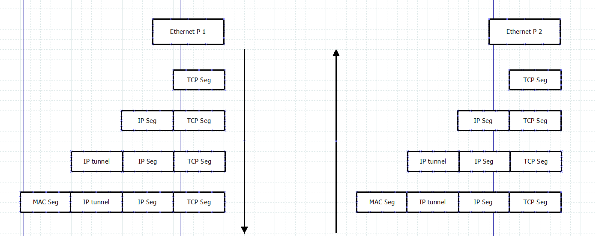
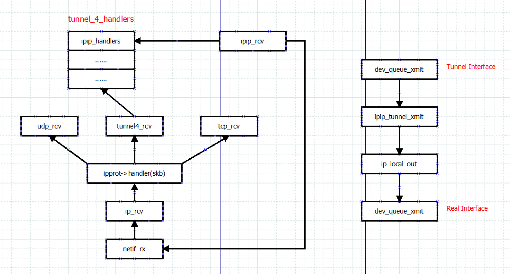

# IPIP Tunnel

## Basic Introduction
IPIP tunnel is one tunnel technology. 



## Code Flow



```c
static int __init tunnel4_init(void)                                                                                                                         
{   
    if (inet_add_protocol(&tunnel4_protocol, IPPROTO_IPIP)) {
        printk(KERN_ERR "tunnel4 init: can't add protocol\n");                                                                                               
        return -EAGAIN;                                                                                                                                      
    }
#if defined(CONFIG_IPV6) || defined(CONFIG_IPV6_MODULE)
    if (inet_add_protocol(&tunnel64_protocol, IPPROTO_IPV6)) {
        printk(KERN_ERR "tunnel64 init: can't add protocol\n");                                                                                              
        inet_del_protocol(&tunnel4_protocol, IPPROTO_IPIP);                                                                                                  
        return -EAGAIN;                                                                                                                                      
    }
#endif
    return 0;                                                                                                                                                
}     

static const struct net_protocol tunnel4_protocol = {
    .handler    =   tunnel4_rcv,
    .err_handler    =   tunnel4_err,
    .no_policy  =   1,
    .netns_ok   =   1,
};

static int tunnel4_rcv(struct sk_buff *skb)
{
    struct xfrm_tunnel *handler;

    if (!pskb_may_pull(skb, sizeof(struct iphdr)))
        goto drop;

    for (handler = tunnel4_handlers; handler; handler = handler->next)
        if (!handler->handler(skb))
            return 0;

    icmp_send(skb, ICMP_DEST_UNREACH, ICMP_PORT_UNREACH, 0);

drop:
    kfree_skb(skb);
    return 0;
}

int xfrm4_tunnel_register(struct xfrm_tunnel *handler, unsigned short family)
{
    struct xfrm_tunnel **pprev;
    int ret = -EEXIST;
    int priority = handler->priority;
    
    mutex_lock(&tunnel4_mutex);
    
    for (pprev = fam_handlers(family); *pprev; pprev = &(*pprev)->next) {
        if ((*pprev)->priority > priority)
            break;
        if ((*pprev)->priority == priority)
            goto err;
    }
    
    handler->next = *pprev;
    *pprev = handler;
    
    ret = 0;

err:
    mutex_unlock(&tunnel4_mutex);
    
    return ret;
}

static int __init ipip_init(void)
{
    int err;

    printk(banner);

    err = register_pernet_device(&ipip_net_ops);
    if (err < 0)
        return err;
    err = xfrm4_tunnel_register(&ipip_handler, AF_INET);
    if (err < 0) {
        unregister_pernet_device(&ipip_net_ops);
        printk(KERN_INFO "ipip init: can't register tunnel\n");
    }
    return err;
}

static int ipip_rcv(struct sk_buff *skb)
{
    struct ip_tunnel *tunnel;
    const struct iphdr *iph = ip_hdr(skb);

    rcu_read_lock();
    if ((tunnel = ipip_tunnel_lookup(dev_net(skb->dev),
                    iph->saddr, iph->daddr)) != NULL) {
        if (!xfrm4_policy_check(NULL, XFRM_POLICY_IN, skb)) {
            rcu_read_unlock();
            kfree_skb(skb);
            return 0;
        }

        secpath_reset(skb);

        skb->mac_header = skb->network_header;
        skb_reset_network_header(skb);
        skb->protocol = htons(ETH_P_IP);
        skb->pkt_type = PACKET_HOST;

        tunnel->dev->stats.rx_packets++;
        tunnel->dev->stats.rx_bytes += skb->len;
        skb->dev = tunnel->dev;
        skb_dst_drop(skb);
        nf_reset(skb);
        ipip_ecn_decapsulate(iph, skb);
        netif_rx(skb);                                                                                                                                                                       
        rcu_read_unlock();
        return 0;
    }
    rcu_read_unlock();

    return -1;
}

      
```

```c
static int __net_init ipip_init_net(struct net *net)
{
    struct ipip_net *ipn = net_generic(net, ipip_net_id);
    int err;

    ipn->tunnels[0] = ipn->tunnels_wc;
    ipn->tunnels[1] = ipn->tunnels_l;
    ipn->tunnels[2] = ipn->tunnels_r;
    ipn->tunnels[3] = ipn->tunnels_r_l;

    ipn->fb_tunnel_dev = alloc_netdev(sizeof(struct ip_tunnel),
                       "tunl0",
                       ipip_tunnel_setup);

}


static void ipip_tunnel_setup(struct net_device *dev)
{
    dev->netdev_ops     = &ipip_netdev_ops;
    dev->destructor     = free_netdev;

    dev->type       = ARPHRD_TUNNEL;
    dev->hard_header_len    = LL_MAX_HEADER + sizeof(struct iphdr);
    dev->mtu        = ETH_DATA_LEN - sizeof(struct iphdr);
    dev->flags      = IFF_NOARP;
    dev->iflink     = 0;
    dev->addr_len       = 4;
    dev->features       |= NETIF_F_NETNS_LOCAL;
    dev->priv_flags     &= ~IFF_XMIT_DST_RELEASE;
}

static const struct net_device_ops ipip_netdev_ops = {                                                                                                                                       
    .ndo_uninit = ipip_tunnel_uninit,
    .ndo_start_xmit = ipip_tunnel_xmit,
    .ndo_do_ioctl   = ipip_tunnel_ioctl,
    .ndo_change_mtu = ipip_tunnel_change_mtu,

};

static netdev_tx_t ipip_tunnel_xmit(struct sk_buff *skb, struct net_device *dev)
{
    skb->transport_header = skb->network_header;
    skb_push(skb, sizeof(struct iphdr));
    skb_reset_network_header(skb);
    memset(&(IPCB(skb)->opt), 0, sizeof(IPCB(skb)->opt));
    IPCB(skb)->flags &= ~(IPSKB_XFRM_TUNNEL_SIZE | IPSKB_XFRM_TRANSFORMED |
                  IPSKB_REROUTED);
    skb_dst_drop(skb);
    skb_dst_set(skb, &rt->u.dst);

    /*
     *  Push down and install the IPIP header.
     */

    iph             =   ip_hdr(skb);
    iph->version        =   4;
    iph->ihl        =   sizeof(struct iphdr)>>2;
    iph->frag_off       =   df;
    iph->protocol       =   IPPROTO_IPIP;
    iph->tos        =   INET_ECN_encapsulate(tos, old_iph->tos);
    iph->daddr      =   rt->rt_dst;
    iph->saddr      =   rt->rt_src;

    if ((iph->ttl = tiph->ttl) == 0)
        iph->ttl    =   old_iph->ttl;

    nf_reset(skb);

    IPTUNNEL_XMIT();
    return NETDEV_TX_OK;

}

#define IPTUNNEL_XMIT() do {                        \                                                                                                                                        
    int err;                            \
    int pkt_len = skb->len - skb_transport_offset(skb);     \
                                    \
    skb->ip_summed = CHECKSUM_NONE;                 \
    ip_select_ident(iph, &rt->u.dst, NULL);             \
                                    \
    err = ip_local_out(skb);                    \
    if (likely(net_xmit_eval(err) == 0)) {              \
        txq->tx_bytes += pkt_len;               \
        txq->tx_packets++;                  \
    } else {                            \
        stats->tx_errors++;                 \
        stats->tx_aborted_errors++;             \
    }                               \
} while (0)
```
