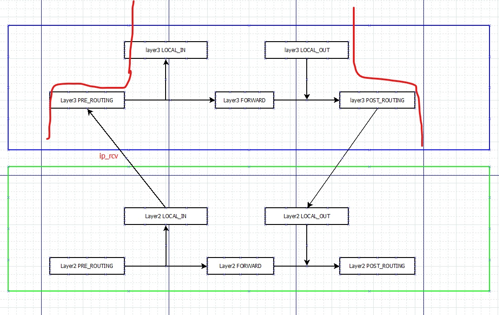
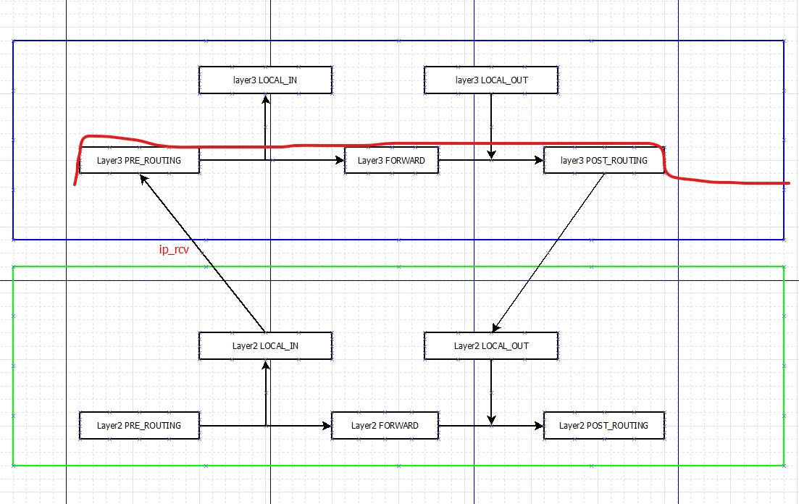
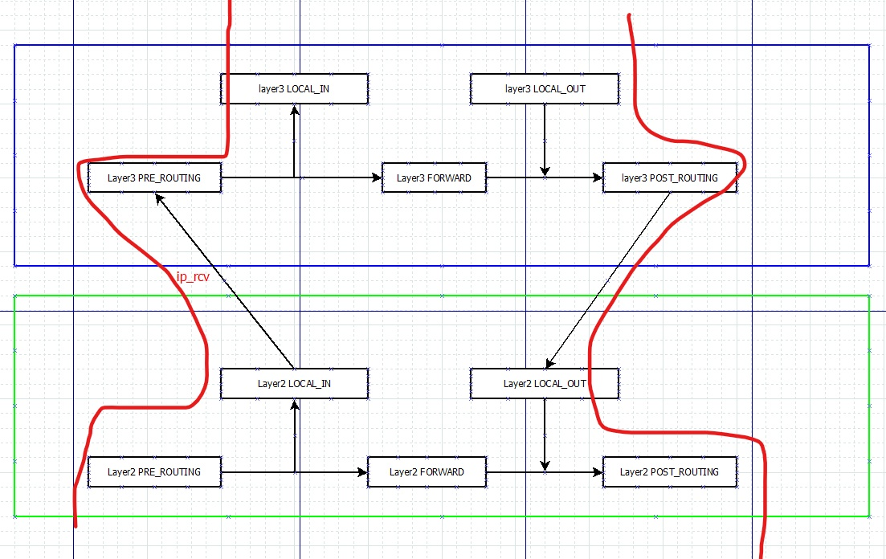
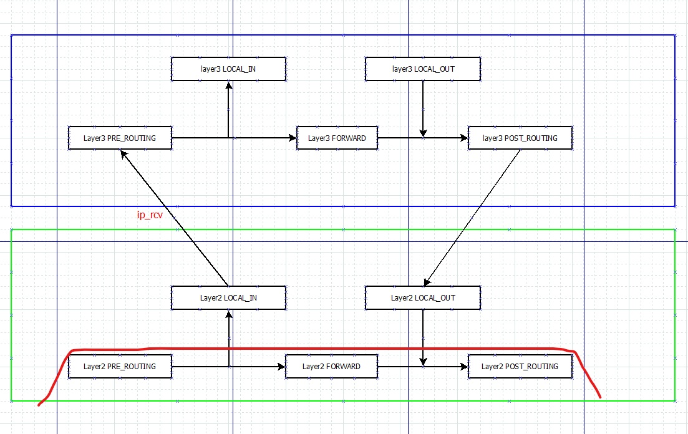

# IP Tables & Ebtables

## IP Tables
- Filter Table: accept/drop some special packet.
- Nat Table: modify Source/Destination IP/source destintaion port
- Manle Table: modify tos/priority/mark, qos related or skb mark
- Raw Table: Raw table is used mainly for configuring exemptions from connection tracking in combination with the NOTRACK target.
### Chains
- NF_INET_PRE_ROUTING: raw(-300),mangle(-150),nat(-100)
- NF_INET_LOCAL_IN: mangle(-150),filter(0),nat(100),
- NF_INET_FORWARD: mangle(-150),filter(0),
- NF_INET_LOCAL_OUT:raw(-300),mangle(-150),nat(-100),filter(0),
- NF_INET_POST_ROUTING:mangle(-150),nat(100),

### Code Flow

#### Net Interface does not connect with one bridge, and this packet is for this ONT.
**Flow is NF_INET_PRE_ROUTING--> NF_INET_LOCAL_IN --> NF_INET_LOCAL_OUT --> NF_INET_POST_ROUTING**

```c
int ip_rcv(struct sk_buff *skb, struct net_device *dev, struct packet_type *pt, struct net_device *orig_dev)
{
    return NF_HOOK(NFPROTO_IPV4, NF_INET_PRE_ROUTING,
               net, NULL, skb, dev, NULL,
               ip_rcv_finish);
}

static int ip_rcv_finish(struct net *net, struct sock *sk, struct sk_buff *skb)
{
    if (!skb_valid_dst(skb)) {
        int err = ip_route_input_noref(skb, iph->daddr, iph->saddr,
                           iph->tos, skb->dev);
        if (unlikely(err)) {
            if (err == -EXDEV)
                NET_INC_STATS_BH(net, LINUX_MIB_IPRPFILTER);
            goto drop;
        }
    }
    return dst_input(skb);
}

//dst_input can be ip_forward or ip_local_deliver. In this scenario, it is ip_local_deliver
int ip_local_deliver(struct sk_buff *skb)
{
    /*
     *  Reassemble IP fragments.
     */
    struct net *net = dev_net(skb->dev);

    if (ip_is_fragment(ip_hdr(skb))) {
        if (ip_defrag(net, skb, IP_DEFRAG_LOCAL_DELIVER))
            return 0;
    }

    return NF_HOOK(NFPROTO_IPV4, NF_INET_LOCAL_IN,
               net, NULL, skb, skb->dev, NULL,
               ip_local_deliver_finish);
}

//Here, ip_local_deliver_finish will call udp_recvmsg/tcp_recvmsg. When the application process receive this message, and send the response message. 
//udp_sendmsg/tcp_sendmsg will call ip_sendmsg

int ip_send_skb(struct net *net, struct sk_buff *skb)
{
    int err;

    err = ip_local_out(net, skb->sk, skb);
    if (err) {
        if (err > 0)
            err = net_xmit_errno(err);
        if (err)
            IP_INC_STATS(net, IPSTATS_MIB_OUTDISCARDS);
    }

    return err;
}


int __ip_local_out(struct net *net, struct sock *sk, struct sk_buff *skb)
{
    struct iphdr *iph = ip_hdr(skb);

    iph->tot_len = htons(skb->len);
    ip_send_check(iph);

    skb->protocol = htons(ETH_P_IP);

    return nf_hook(NFPROTO_IPV4, NF_INET_LOCAL_OUT,
               net, sk, skb, NULL, skb_dst(skb)->dev,
               dst_output);
}

int ip_output(struct net *net, struct sock *sk, struct sk_buff *skb)
{
    struct net_device *dev = skb_dst(skb)->dev;

    IP_UPD_PO_STATS(net, IPSTATS_MIB_OUT, skb->len);

    skb->dev = dev;
    skb->protocol = htons(ETH_P_IP);

    return NF_HOOK_COND(NFPROTO_IPV4, NF_INET_POST_ROUTING,
                net, sk, skb, NULL, dev,
                ip_finish_output,
                !(IPCB(skb)->flags & IPSKB_REROUTED));
}

```

#### Net Interface does not connect with one bridge, and this packet is not for this ONT, which means we need to forward it.
**Flow is NF_INET_PRE_ROUTING--> NF_INET_FORWARD --> NF_INET_POST_ROUTING**

```c
int ip_rcv(struct sk_buff *skb, struct net_device *dev, struct packet_type *pt, struct net_device *orig_dev)
{
    return NF_HOOK(NFPROTO_IPV4, NF_INET_PRE_ROUTING,
               net, NULL, skb, dev, NULL,
               ip_rcv_finish);
}

static int ip_rcv_finish(struct net *net, struct sock *sk, struct sk_buff *skb)
{
    if (!skb_valid_dst(skb)) {
        int err = ip_route_input_noref(skb, iph->daddr, iph->saddr,
                           iph->tos, skb->dev);
        if (unlikely(err)) {
            if (err == -EXDEV)
                NET_INC_STATS_BH(net, LINUX_MIB_IPRPFILTER);
            goto drop;
        }
    }
    return dst_input(skb);
}

//Here, our system will check whehter this packet is for us. If not, dst_input is ip_forward.

int ip_forward(struct sk_buff *skb)
{
    return NF_HOOK(NFPROTO_IPV4, NF_INET_FORWARD,
               net, NULL, skb, skb->dev, rt->dst.dev,
               ip_forward_finish);
}

static int ip_forward_finish(struct net *net, struct sock *sk, struct sk_buff *skb)
{
    struct ip_options *opt  = &(IPCB(skb)->opt);

    IP_INC_STATS_BH(net, IPSTATS_MIB_OUTFORWDATAGRAMS);
    IP_ADD_STATS_BH(net, IPSTATS_MIB_OUTOCTETS, skb->len);

    if (unlikely(opt->optlen))
        ip_forward_options(skb);

    skb_sender_cpu_clear(skb);
    return dst_output(net, sk, skb);
}

int ip_output(struct net *net, struct sock *sk, struct sk_buff *skb)
{
    struct net_device *dev = skb_dst(skb)->dev;

    IP_UPD_PO_STATS(net, IPSTATS_MIB_OUT, skb->len);

    skb->dev = dev;
    skb->protocol = htons(ETH_P_IP);

    return NF_HOOK_COND(NFPROTO_IPV4, NF_INET_POST_ROUTING,
                net, sk, skb, NULL, dev,
                ip_finish_output,
                !(IPCB(skb)->flags & IPSKB_REROUTED));
}

```

## Ebtables

### Chains

- NF_BR_PRE_ROUTING:nat(-300)
- NF_BR_LOCAL_IN:filter(-200)
- NF_BR_FORWARD:filter(-200)
- NF_BR_LOCAL_OUT:filter(-200),nat(100)
- NF_BR_POST_ROUTING:nat(300)
- NF_BR_BROUTING:broute

### Code Flow

#### Scenario, net interface is connected to one bridge, and the packet is for this device.
**State change flow: NF_BR_BROUTING -->NF_BR_LOCAL_IN --> NF_BR_PRE_ROUTING**

```c
rx_handler_result_t br_handle_frame(struct sk_buff **pskb)
{
    case BR_STATE_FORWARDING:
        rhook = rcu_dereference(br_should_route_hook);
        if (rhook) {
            if ((*rhook)(skb)) {
                *pskb = skb;
                return RX_HANDLER_PASS;
            }
            dest = eth_hdr(skb)->h_dest;
        }

    case BR_STATE_LEARNING:
        if (ether_addr_equal(p->br->dev->dev_addr, dest))
            skb->pkt_type = PACKET_HOST;

        NF_HOOK(NFPROTO_BRIDGE, NF_BR_PRE_ROUTING,
            dev_net(skb->dev), NULL, skb, skb->dev, NULL,
            br_handle_frame_finish);
        break;
		
}

int br_handle_frame_finish(struct net *net, struct sock *sk, struct sk_buff *skb)
{
	if ((dst = __br_fdb_get(br, dest, vid)) &&
            dst->is_local) {
        skb2 = skb;
        /* Do not forward the packet since it's local. */
        skb = NULL;
    }

    if (skb) {
        if (dst) {
            dst->used = jiffies;
            br_forward(dst->dst, skb, skb2);
        } else
            br_flood_forward(br, skb, skb2, unicast);
    }

    if (skb2)
        return br_pass_frame_up(skb2);
}

static int br_pass_frame_up(struct sk_buff *skb)
{
    indev = skb->dev;
    skb->dev = brdev;
    skb = br_handle_vlan(br, vg, skb);

    return NF_HOOK(NFPROTO_BRIDGE, NF_BR_LOCAL_IN,
               dev_net(indev), NULL, skb, indev, NULL,
               br_netif_receive_skb);

}


//Note: skb->dev change to br_dev, so next netif_receive_skb flow will change.
static int
br_netif_receive_skb(struct net *net, struct sock *sk, struct sk_buff *skb)
{
    br_drop_fake_rtable(skb);
    return netif_receive_skb(skb);
}

//Next step is the same as IPtable

int ip_rcv(struct sk_buff *skb, struct net_device *dev, struct packet_type *pt, struct net_device *orig_dev)
{
    return NF_HOOK(NFPROTO_IPV4, NF_INET_PRE_ROUTING,
               net, NULL, skb, dev, NULL,
               ip_rcv_finish);
}

//When the upper application receive the message and send the response message.
int ip_output(struct net *net, struct sock *sk, struct sk_buff *skb)
{
    struct net_device *dev = skb_dst(skb)->dev;

    IP_UPD_PO_STATS(net, IPSTATS_MIB_OUT, skb->len);

    skb->dev = dev;
    skb->protocol = htons(ETH_P_IP);

    return NF_HOOK_COND(NFPROTO_IPV4, NF_INET_POST_ROUTING,
                net, sk, skb, NULL, dev,
                ip_finish_output,
                !(IPCB(skb)->flags & IPSKB_REROUTED));
}


static int ip_finish_output(struct net *net, struct sock *sk, struct sk_buff *skb)
{
    unsigned int mtu;

#if defined(CONFIG_NETFILTER) && defined(CONFIG_XFRM)
    /* Policy lookup after SNAT yielded a new policy */
+---  4 lines: if (skb_dst(skb)->xfrm) {------------------------------------------------------------------------------------------------------------------------------------
#endif
    mtu = ip_skb_dst_mtu(skb);
    if (skb_is_gso(skb))
        return ip_finish_output_gso(net, sk, skb, mtu);

    if (skb->len > mtu || (IPCB(skb)->flags & IPSKB_FRAG_PMTU))
        return ip_fragment(net, sk, skb, mtu, ip_finish_output2);

    return ip_finish_output2(net, sk, skb);
}

static int ip_finish_output2(struct net *net, struct sock *sk, struct sk_buff *skb)
{
	 dst_neigh_output(dst, neigh, skb);
}

int neigh_resolve_output(struct neighbour *neigh, struct sk_buff *skb)
{
	rc = dev_queue_xmit(skb);
}

//Note: Here the skb's device is bridge, not the ethernet device. Therefore, the bridge device will receive this packet and process further.
netdev_tx_t br_dev_xmit(struct sk_buff *skb, struct net_device *dev)
{
	br_deliver(dst->dst, skb);
}

static void __br_deliver(const struct net_bridge_port *to, struct sk_buff *skb)
{
    struct net_bridge_vlan_group *vg;

    vg = nbp_vlan_group_rcu(to);
    skb = br_handle_vlan(to->br, vg, skb);
    if (!skb)
        return;

    skb->dev = to->dev;

    if (unlikely(netpoll_tx_running(to->br->dev))) {
        if (!is_skb_forwardable(skb->dev, skb))
            kfree_skb(skb);
+----  4 lines: else {------------------------------------------------------------------------------------------------------------------------------------------------------
        return;
    }

    NF_HOOK(NFPROTO_BRIDGE, NF_BR_LOCAL_OUT,
        dev_net(skb->dev), NULL, skb,NULL, skb->dev,
        br_forward_finish);
}


```

#### Scenario, net interface is connected to one bridge, and the packet is not for this device.
**State change flow: NF_BR_BROUTING -->NF_BR_FORWARD --> NF_BR_PRE_ROUTING**

```c
rx_handler_result_t br_handle_frame(struct sk_buff **pskb)
{
    case BR_STATE_FORWARDING:
        rhook = rcu_dereference(br_should_route_hook);
        if (rhook) {
            if ((*rhook)(skb)) {
                *pskb = skb;
                return RX_HANDLER_PASS;
            }
            dest = eth_hdr(skb)->h_dest;
        }

    case BR_STATE_LEARNING:
        if (ether_addr_equal(p->br->dev->dev_addr, dest))
            skb->pkt_type = PACKET_HOST;

        NF_HOOK(NFPROTO_BRIDGE, NF_BR_PRE_ROUTING,
            dev_net(skb->dev), NULL, skb, skb->dev, NULL,
            br_handle_frame_finish);
        break;
		
}

int br_handle_frame_finish(struct net *net, struct sock *sk, struct sk_buff *skb)
{
	if ((dst = __br_fdb_get(br, dest, vid)) &&
            dst->is_local) {
        skb2 = skb;
        /* Do not forward the packet since it's local. */
        skb = NULL;
    }

    if (skb) {
        if (dst) {
            dst->used = jiffies;
            br_forward(dst->dst, skb, skb2);
        } else
            br_flood_forward(br, skb, skb2, unicast);
    }

    if (skb2)
        return br_pass_frame_up(skb2);
}

static void __br_forward(const struct net_bridge_port *to, struct sk_buff *skb)
{
    struct net_bridge_vlan_group *vg;
    struct net_device *indev;

+---  4 lines: if (skb_warn_if_lro(skb)) {----------------------------------------------------------------------------------------------------------------------------------

    vg = nbp_vlan_group_rcu(to);
    skb = br_handle_vlan(to->br, vg, skb);
    if (!skb)
        return;

    indev = skb->dev;
    skb->dev = to->dev;
    skb_forward_csum(skb);

    NF_HOOK(NFPROTO_BRIDGE, NF_BR_FORWARD,
        dev_net(indev), NULL, skb, indev, skb->dev,
        br_forward_finish);
}


int br_forward_finish(struct net *net, struct sock *sk, struct sk_buff *skb)
{
    return NF_HOOK(NFPROTO_BRIDGE, NF_BR_POST_ROUTING,
               net, sk, skb, NULL, skb->dev,
               br_dev_queue_push_xmit);

}

```