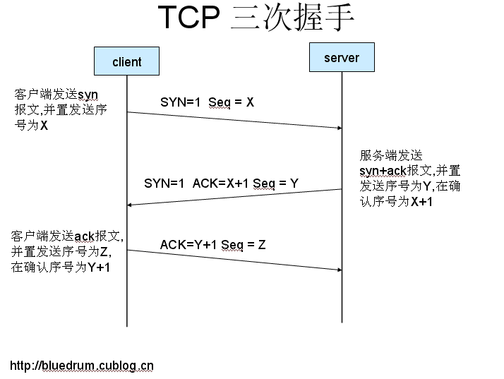

# TCP For Linux 1.0

## TCP Basic Knowledge
### TCP 3 handshake
- client 主动发起，发送SYNC
- server 被动发起，收到client的SYNC, 发送SYNC+ACK
- client 发送ACK，握手成功



### TCP 4 times to wave


- client 主动发起，发送FIN
- Server response ack
- server side send FIN
- client side response ack

## Basic Usage for TCP Socket on Application Layer

### Server Side
- socket: create one socket
- bind: bind socket with one port
- listen: set socket to listen state
- accept: receive clients' socket request
- recv: receive packets
- send: send packets

### Client Side
- socket: create one socket
- connect: connect remote server
- recv: receive packets
- send: send packets

## Code Flow

### Connect

```c
asmlinkage int
sys_socketcall(int call, unsigned long *args)
{
    case SYS_CONNECT:
        er = verify_area(VERIFY_READ, args, 3 * sizeof(long));
        if (er) 
            return er;
        return (sock_connect(get_fs_long(args + 0),
                             (struct sockaddr *)get_fs_long(args + 1),
                             get_fs_long(args + 2)));                         
}

static int 
inet_connect(struct socket *sock, struct sockaddr * uaddr,
             int addr_len, int flags) 
{
	err = sk->prot->connect(sk, (struct sockaddr_in *)uaddr, addr_len);
	while (sk->state == TCP_SYN_SENT || sk->state == TCP_SYN_RECV) {
        interruptible_sleep_on(sk->sleep);
        if (current->signal & ~current->blocked) {
            sti();
            return (-ERESTARTSYS);
        }
	}
}

//In tcp_connect, sk->state changes from TCP_CLOSE to TCP_CONNECT_SENT.
static int
tcp_connect(struct sock *sk, struct sockaddr_in *usin, int addr_len)
{
    sk->inuse = 1;
    sk->daddr = sin.sin_addr.s_addr;
    sk->write_seq = jiffies * SEQ_TICK - seq_offset;
    sk->window_seq = sk->write_seq;
    sk->rcv_ack_seq = sk->write_seq - 1;
    sk->err = 0;
    sk->dummy_th.dest = sin.sin_port;
    release_sock(sk);
	buff = sk->prot->wmalloc(sk, MAX_SYN_SIZE, 0, GFP_KERNEL);
	    sk->inuse = 1;
    buff->mem_addr = buff;
    buff->mem_len = MAX_SYN_SIZE;
    buff->len = 24;
    buff->sk = sk;
    buff->free = 1;
    t1 = (struct tcphdr *) buff->data;

    /* Put in the IP header and routing stuff. */
    /* We need to build the routing stuff fromt the things saved in skb. */
    tmp = sk->prot->build_header(buff, sk->saddr, sk->daddr, &dev,
                                 IPPROTO_TCP, NULL, MAX_SYN_SIZE, sk->ip_tos, sk->ip_ttl);
    t1->rst = 0;
    t1->urg = 0;
    t1->psh = 0;
    t1->syn = 1; //SYNC
    t1->urg_ptr = 0;
    t1->doff = 6;
	
    sk->state = TCP_SYN_SENT;
    sk->rtt = TCP_CONNECT_TIME;
    reset_timer(sk, TIME_WRITE, TCP_CONNECT_TIME);    /* Timer for repeating the SYN until an answer */
    sk->retransmits = TCP_RETR2 - TCP_SYN_RETRIES;

    sk->prot->queue_xmit(sk, dev, buff, 0);

    release_sock(sk);
    return (0);
}


```
