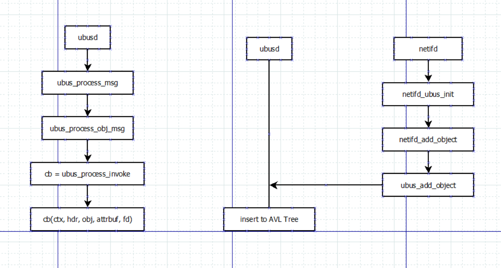

# ubus
ubus is OpenWrt's bus mechanism, which is used for IPC.

ubusd是一个后台进程。通过socket的方式与其他进程进程通信。其他通信启动时需要通过socket
对object和action进行注册。多个其他进程需要通信时，都需要通过ubusd进行转发。

## Code Example
**以ubus cli call network reload 为例，查看ubus源码的主要实现**

### netifd init/register object to ubus
```c
static struct ubus_method main_object_methods[] = {
    { .name = "restart", .handler = netifd_handle_restart },
    { .name = "reload", .handler = netifd_handle_reload },
    UBUS_METHOD("add_host_route", netifd_add_host_route, route_policy),
    { .name = "get_proto_handlers", .handler = netifd_get_proto_handlers },
    UBUS_METHOD("add_dynamic", netifd_add_dynamic, dynamic_policy),
};

static struct ubus_object_type main_object_type =
    UBUS_OBJECT_TYPE("netifd", main_object_methods);

static struct ubus_object main_object = {
    .name = "network",
    .type = &main_object_type,
    .methods = main_object_methods,
    .n_methods = ARRAY_SIZE(main_object_methods),
};

int
netifd_ubus_init(const char *path)
{
    uloop_init();
    ubus_path = path;

    ubus_ctx = ubus_connect(path);
    if (!ubus_ctx)
        return -EIO;

    DPRINTF("connected as %08x\n", ubus_ctx->local_id);
    ubus_ctx->connection_lost = netifd_ubus_connection_lost;
    netifd_ubus_add_fd();

    netifd_add_object(&main_object);
    netifd_add_object(&dev_object);
    netifd_add_object(&wireless_object);
    netifd_add_iface_object();

    return 0;
}

static void netifd_add_object(struct ubus_object *obj)
{
    int ret = ubus_add_object(ubus_ctx, obj);

    if (ret != 0)
        fprintf(stderr, "Failed to publish object '%s': %s\n", obj->name, ubus_strerror(ret));
}

// Here, netifd will send one adding-object request to server, ubusd.

```

### When ubus cli send command "ubus call network reload"
```c
void __hidden
ubus_process_msg(struct ubus_context *ctx, struct ubus_msghdr_buf *buf, int fd)
{
    switch(buf->hdr.type) {
    case UBUS_MSG_STATUS:
    case UBUS_MSG_DATA:
        ubus_process_req_msg(ctx, buf, fd);
        break;

    case UBUS_MSG_INVOKE:
    case UBUS_MSG_UNSUBSCRIBE:
    case UBUS_MSG_NOTIFY:
        if (ctx->stack_depth) {
            ubus_queue_msg(ctx, buf);
            break;
        }

        ubus_process_obj_msg(ctx, buf, fd);
        break;
    case UBUS_MSG_MONITOR:
        if (ctx->monitor_cb)
            ctx->monitor_cb(ctx, buf->hdr.seq, buf->data);
        break;
    }
}


void __hidden ubus_process_obj_msg(struct ubus_context *ctx, struct ubus_msghdr_buf *buf, int fd)
{
    void (*cb)(struct ubus_context *, struct ubus_msghdr *,
           struct ubus_object *, struct blob_attr **, int fd);
    struct ubus_msghdr *hdr = &buf->hdr;
    struct blob_attr **attrbuf;
    struct ubus_object *obj;
    uint32_t objid;
    void *prev_data = NULL;
    attrbuf = ubus_parse_msg(buf->data);
    if (!attrbuf[UBUS_ATTR_OBJID])
        return;

    objid = blob_get_u32(attrbuf[UBUS_ATTR_OBJID]);
    obj = avl_find_element(&ctx->objects, &objid, obj, avl);

    switch (hdr->type) {
    case UBUS_MSG_INVOKE:
        cb = ubus_process_invoke;
        break;
    case UBUS_MSG_UNSUBSCRIBE:
        cb = ubus_process_unsubscribe;
        break;
    case UBUS_MSG_NOTIFY:
        cb = ubus_process_notify;
        break;
    default:
        return;
    }

    if (buf == &ctx->msgbuf) {
        prev_data = buf->data;
        buf->data = NULL;
    }

    cb(ctx, hdr, obj, attrbuf, fd);
}

static void
ubus_process_invoke(struct ubus_context *ctx, struct ubus_msghdr *hdr,
            struct ubus_object *obj, struct blob_attr **attrbuf, int fd)
{

    for (method = 0; method < obj->n_methods; method++)
        if (!obj->methods[method].name ||
            !strcmp(obj->methods[method].name,
                    blob_data(attrbuf[UBUS_ATTR_METHOD])))
            goto found;


    ret = obj->methods[method].handler(ctx, obj, &req,
                       blob_data(attrbuf[UBUS_ATTR_METHOD]),
                       attrbuf[UBUS_ATTR_DATA]);


}

```

### Flow


