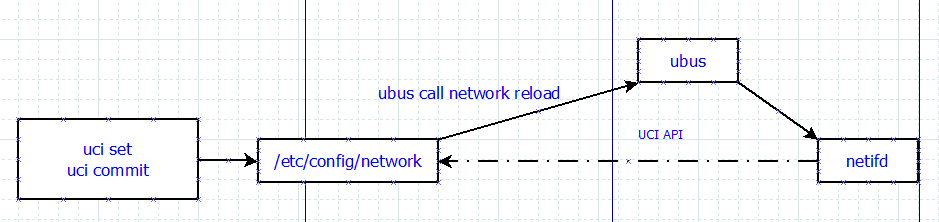

# Openwrt config management

## UCI
### Basic Introduction
UCI is a small utility written in C (a shell script-wrapper is available as well) and is intended to centralize the whole configuration of a device running OpenWrt.
UCI configuration files are located in the directory /etc/config/

### uci command usage

```c
root@NOKIA-10G-SFU:/# uci show network
network.loopback=interface
network.loopback.ifname='lo'
network.loopback.proto='static'
network.loopback.ipaddr='127.0.0.1'
network.loopback.netmask='255.0.0.0'
 
```

```c
uci set network.loopback.ipaddr='127.0.0.2'
uci commit
uci show network

root@TEMP:/# uci show network
network.loopback=interface
network.loopback.ifname='lo'
network.loopback.proto='static'
network.loopback.netmask='255.0.0.0'
network.loopback.ipaddr='127.0.0.2'


uci delete network.loopback
```

### Take effect
Now we finish modifying the uci config file, however it doesn't mean the new configuration take effect.
We need to restart the related service

```c
/etc/init.d/network restart
```

### UCI Example for modifying the hostname

```c
uci set system.@system[0].hostname=JohnsonPC
uci commit system
uci show system

/etc/init.d/system restart

root@JohnsonPC:/#
```

## UBUS

### Ubus introduction
To provide Inter-process communication between various daemons and applications in OpenWrt a project called ubus has been developed. It consists of several parts including daemon, library and some extra helpers. 
The heart of this project is the ubusd daemon.

### ubus tool

The ubus command line tool allows to interact with the ubusd server (with all currently registered services). It's useful for investigating/debugging registered namespaces as well as writing shell scripts. For calling procedures with parameters and returning responses it uses the user-friendly JSON format.

```c
ubus call network reload
```

In this example, ubus call will send json-format message to ubusd, ubusd will parse the message, and check which process register the related object, and call the related handler.


