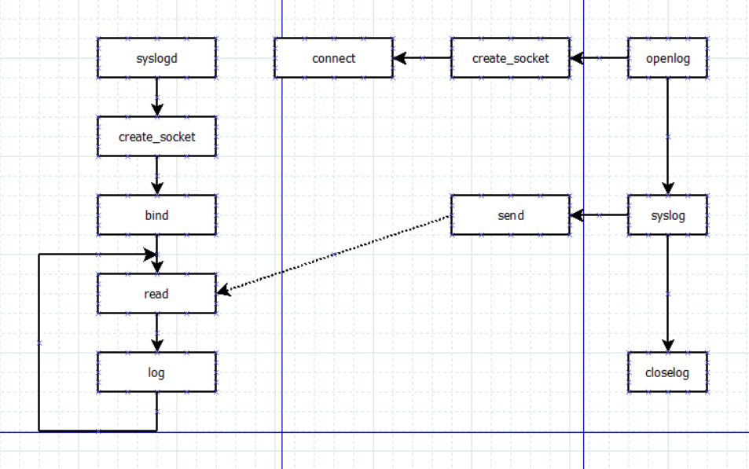

# syslogd

syslog 有一套API, openlog/syslog/closelog.

syslogd 有一个参数，指定一个配置文件，例如：
syslogd -s 1024 -b 3 -f /tmp/syslog.conf
-s: 设置文件的大小，文件写满以后，会以加后缀的方式创建一个新文件。
-f: syslog 配置文件。
-b: N rotated logs to keep (default 1, max 99, 0=purge)

syslog.conf 文件可以指定不同log写到哪个文件里面。
**
cat syslog.conf
kern,auth,authpriv,syslog,user.warning;daemon.notice  /logs/messages
**

**
syslogd --help
BusyBox v1.30.1 () multi-call binary.

Usage: syslogd [OPTIONS]

System logging utility

        -n              Run in foreground
        -R HOST[:PORT]  Log to HOST:PORT (default PORT:514)
        -L              Log locally and via network (default is network only if -R)
        -C[size_kb]     Log to shared mem buffer (use logread to read it)
        -K              Log to kernel printk buffer (use dmesg to read it)
        -O FILE         Log to FILE (default: /var/log/messages, stdout if -)
        -s SIZE         Max size (KB) before rotation (default 200KB, 0=off)
        -b N            N rotated logs to keep (default 1, max 99, 0=purge)
        -l N            Log only messages more urgent than prio N (1-8)
        -S              Smaller output
        -t              Strip client-generated timestamps
        -D              Drop duplicates
        -f FILE         Use FILE as config (default:/etc/syslog.conf)
**

## syslog api
### Basic usage
- void openlog(const char *ident, int option, int facility);
- void syslog(int priority, const char *format, ...);
- void closelog(void);

### Basic Example
```c
#include <syslog.h>

int main(int argc, char **argv)
{
    openlog("syslog_test", LOG_PID, LOG_DAEMON);

    syslog(LOG_EMERG, "system is unusable");
    syslog(LOG_ALERT, "action must be taken immediately");
    syslog(LOG_CRIT, "critical conditions");
    syslog(LOG_ERR, "error conditions");
    syslog(LOG_WARNING, "warning conditions");
    syslog(LOG_NOTICE, "normal, but significant, condition");
    syslog(LOG_INFO, "informational message");
    syslog(LOG_DEBUG, "debug-level message");

    closelog();

    return 0;
}

```

### Output

Default Destination: /var/log/messages 

- Aug 29 18:10:06 sfu03 syslog_test[24343]: system is unusable
- Aug 29 18:10:06 sfu03 syslog_test[24343]: action must be taken immediately
- Aug 29 18:10:06 sfu03 syslog_test[24343]: critical conditions
- Aug 29 18:10:06 sfu03 syslog_test[24343]: error conditions
- Aug 29 18:10:06 sfu03 syslog_test[24343]: warning conditions
- Aug 29 18:10:06 sfu03 syslog_test[24343]: normal, but significant, condition
- Aug 29 18:10:06 sfu03 syslog_test[24343]: informational message

### API Code Flow

#### openlog
openlog open one socket and connect to syslogd
```c
void
openlog(ident, logstat, logfac)
    const char *ident;
    int logstat, logfac;
{
    if (ident != NULL)
        LogTag = ident;
    LogStat = logstat;
    if (logfac != 0 && (logfac &~ LOG_FACMASK) == 0)
        LogFacility = logfac;

    if (LogFile == -1) {
        SyslogAddr.sa_family = AF_UNIX;
        (void)strncpy(SyslogAddr.sa_data, _PATH_LOG,
            sizeof(SyslogAddr.sa_data));
        if (LogStat & LOG_NDELAY) {
            if ((LogFile = socket(AF_UNIX, SOCK_DGRAM, 0)) == -1)
                return;
            (void)fcntl(LogFile, F_SETFD, 1);
        }
    }
    if (LogFile != -1 && !connected)
        if (connect(LogFile, &SyslogAddr, sizeof(SyslogAddr)) == -1) {
            (void)close(LogFile);
            LogFile = -1;
        } else
            connected = 1;
}

```
#### syslog
```c
void
#if __STDC__
syslog(int pri, const char *fmt, ...)
#else
syslog(pri, fmt, va_alist)
    int pri;
    char *fmt;
    va_dcl
#endif
{
    va_list ap;

#if __STDC__
    va_start(ap, fmt);
#else
    va_start(ap);
#endif
    vsyslog(pri, fmt, ap);
    va_end(ap);
}

void
vsyslog(pri, fmt, ap)
    int pri;
    register const char *fmt;
    va_list ap;
{
    if (send(LogFile, tbuf, cnt, 0) >= 0)
        return;

}
```
#### closelog
```c
void
closelog()
{
    (void)close(LogFile);
    LogFile = -1;
    connected = 0;
}

```


## syslogd code flow
```c
int syslogd_main(int argc UNUSED_PARAM, char **argv)
{
    write_pidfile("/var/run/syslogd.pid");
    do_syslogd();
}

static void do_syslogd(void)
{
    sock_fd = create_socket();
	while(1){
 read_again:
        sz = read(sock_fd, recvbuf, MAX_READ - 1);
        while (1) {
            if (sz == 0)
                goto read_again;
            /* man 3 syslog says: "A trailing newline is added when needed".
             * However, neither glibc nor uclibc do this:
             * syslog(prio, "test")   sends "test\0" to /dev/log,
             * syslog(prio, "test\n") sends "test\n\0".
             * IOW: newline is passed verbatim!
             * I take it to mean that it's syslogd's job
             * to make those look identical in the log files. */
            if (recvbuf[sz-1] != '\0' && recvbuf[sz-1] != '\n')
                break;
            sz--;
        }
        if (!ENABLE_FEATURE_REMOTE_LOG || (option_mask32 & OPT_locallog)) {
            recvbuf[sz] = '\0'; /* ensure it *is* NUL terminated */
            split_escape_and_log(recvbuf, sz);
        }
	}
}

static NOINLINE int create_socket(void)
{
    struct sockaddr_un sunx;
    int sock_fd;
    char *dev_log_name;

    memset(&sunx, 0, sizeof(sunx));
    sunx.sun_family = AF_UNIX;

    /* Unlink old /dev/log or object it points to. */
    /* (if it exists, bind will fail) */
    strcpy(sunx.sun_path, "/dev/log");
    dev_log_name = xmalloc_follow_symlinks("/dev/log");
    if (dev_log_name) {
        safe_strncpy(sunx.sun_path, dev_log_name, sizeof(sunx.sun_path));
        free(dev_log_name);
    }
    unlink(sunx.sun_path);

    sock_fd = xsocket(AF_UNIX, SOCK_DGRAM, 0);
    xbind(sock_fd, (struct sockaddr *) &sunx, sizeof(sunx));
    chmod("/dev/log", 0666);

    return sock_fd;
}

static void split_escape_and_log(char *tmpbuf, int len)
{
    tmpbuf += len;
    while (p < tmpbuf) {
        /* Now log it */
        if (LOG_PRI(pri) < G.logLevel)
            timestamp_and_log(pri, G.parsebuf, q - G.parsebuf);
	}
}

static void timestamp_and_log(int pri, char *msg, int len)
{

    if (len < 16 || msg[3] != ' ' || msg[6] != ' '
     || msg[9] != ':' || msg[12] != ':' || msg[15] != ' '
    ) {
        time(&now);
        timestamp = ctime(&now) + 4; /* skip day of week */
    } else {
        now = 0;
        timestamp = msg;
        msg += 16;
    }
    timestamp[15] = '\0';

    /* Log message locally (to file or shared mem) */
    log_locally(now, G.printbuf);

}

static void log_locally(time_t now, char *msg)
{
	//open file
	//write
}
```

## Communication Flow

