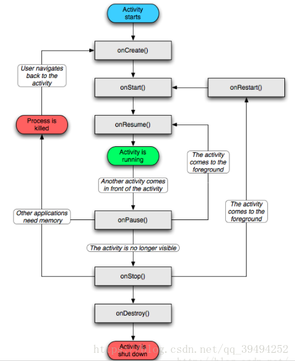

# Activity
Activity 是Android中的一个重要概念，Activity代表一个页面。

## Create one Activity
** new --> Activity --> xxx Activity**
在xxx activity中设置activity的名字，以及对应的layout。对应的layout会默认生成在res-- layout -- xxx.xml

新创的activity会默认创建onCreate Function.
```c
public class test extends AppCompatActivity {

    @Override
    protected void onCreate(Bundle savedInstanceState) {
        super.onCreate(savedInstanceState);
        setContentView(R.layout.activity_test2);
    }
}
```

## Android main activity
一个Android应用会有多个activity页面，页面之间是通过跳转完成的，但是Android需要一个入口Activity。通常情况下， Android Studio在
project中创建的第一个activity就是主Activity。Android Studio是通过下面的语法实现的：

- android.intent.action.MAIN：决定应用的入口Activity，也就是我们启动应用时首先显示哪一个Activity。
- android.intent.category.LAUNCHER：表示activity应该被列入系统的启动器(launcher)(允许用户启动它)。Launcher是安卓系统中的桌面启动器，是桌面UI的统称。
```c
        <activity android:name=".MainActivity">
            <intent-filter>
                <action android:name="android.intent.action.MAIN" />

                <category android:name="android.intent.category.LAUNCHER" />
            </intent-filter>
        </activity>
```

## Android Activity States
- running: 可见，可交互
- pause: 可见，不可交互
- stopped: 不可见，不可交互
- killed: activity处于暂停或停止状态，若内存不足，从内存中删除；

## Activity switch
- 生成一个意图对象 Intent
- 调用setClass方法设置所要启动的Activity
- 调用startActivity方法启动Activity

```c
    public void onClick(View v) {
        Intent intent = new Intent();
        //intent.putExtra("teacher", "Johnson");
        intent.setClass(MainActivity.this,socket.class);
        startActivity(intent);
    }
```
### Method 2
```
    Intent intent = new Intent(this, Register.class);
    startActivity(intent);
```

Activity Switch中activity的活动周期，原activity切换成pause状态，并压入activity的堆栈，新的activity create出来并成为running状态。当我们回退的时候，
新的activity会被destroy掉，原来成为pause的activity重新成为running状态。


