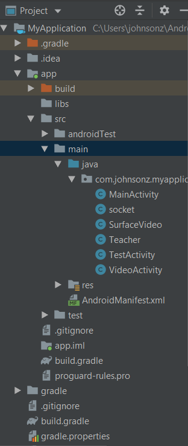
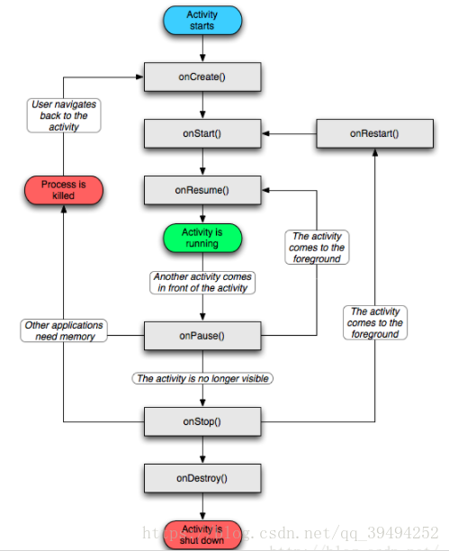

# Android Study Note

## Android Study Project 
Android Project上有两个主要的文件夹，app和gradle。
- app: 源代码。app中有libs/src 两个文件夹。一般情况源码都在src中。src中源码主要在main中。main中包含java和res两个文件夹和AndroidManifest.xml.
- gradle: 用于管理三方库和打包使用。



### Manifest.xml Style
Manifest 主框架是一个application，application下有application的属性，application就是我们整个应用的系统设置，application下有各个activity，activity
 的level等同于页面的level。
#### Android 设置名字
```c
<application
android:label="@string/app_name"
</application>

```
在res values string.xml 中储存了字符串string
```c
<resources>
    <string name="app_name">EEducationOL</string>
</resources>
```

#### Android 设置图标
```c
<application
	android:icon="@mipmap/theme"
</application>
```

#### AndroidManifest.xml Example
```c
<?xml version="1.0" encoding="utf-8"?>
<manifest xmlns:android="http://schemas.android.com/apk/res/android"
    package="com.johnsonz.myapplication">

    <uses-permission android:name="android.permission.WRITE_EXTERNAL_STORAGE" />
    <uses-permission android:name="android.permission.INTERNET" />

    <application
        android:allowBackup="true"
        android:icon="@mipmap/theme"
        android:label="@string/app_name"
        android:roundIcon="@mipmap/ic_launcher_round"
        android:supportsRtl="true"
        android:theme="@style/AppTheme">
        <activity android:name=".MainActivity">
            <intent-filter>
                <action android:name="android.intent.action.MAIN" />

                <category android:name="android.intent.category.LAUNCHER" />
            </intent-filter>
        </activity>
        <activity android:name=".TestActivity" />
        <activity
            android:name=".VideoActivity"
            android:screenOrientation="sensor" />
        <activity android:name=".SurfaceVideo" />
        <activity android:name=".socket"></activity>
    </application>

</manifest>
```

## Android Debug LOG
- Log.v("Johnson", "log content")
- Log.d()
- Log.i()
- Log.w()
- Log.e()

## Layout
- ConstraintLayout

## Component
Android中有四大组件，activity, service，content provider, broadcast receiver.
- Activity: 一个Activity就是一个窗口
- Service: Service组件通常用于为其他组件提供后台服务或监控其他组件的运行状态。
- Content provider: content provider 的主要作用是进程间通信，主要的应用场景是一个app中的数据会被其他app使用的情况，典型的case是通讯录，日历，短信等等。
- broadcast receiver: broadcast recevier的主要作用是对于外部事件的响应，比如说，一款音乐类的app，在听音乐过程中，如果有电话进来应该暂停音乐的播放等等。 

### Activity
Activity 是Android中的一个重要概念，Activity代表一个页面。

#### Create one Activity
** new --> Activity --> xxx Activity**
在xxx activity中设置activity的名字，以及对应的layout。对应的layout会默认生成在res-- layout -- xxx.xml

新创的activity会默认创建onCreate Function.
```c
public class test extends AppCompatActivity {

    @Override
    protected void onCreate(Bundle savedInstanceState) {
        super.onCreate(savedInstanceState);
        setContentView(R.layout.activity_test2);
    }
}
```

#### Android main activity
一个Android应用会有多个activity页面，页面之间是通过跳转完成的，但是Android需要一个入口Activity。通常情况下， Android Studio在
project中创建的第一个activity就是主Activity。Android Studio是通过下面的语法实现的：

- android.intent.action.MAIN：决定应用的入口Activity，也就是我们启动应用时首先显示哪一个Activity。
- android.intent.category.LAUNCHER：表示activity应该被列入系统的启动器(launcher)(允许用户启动它)。Launcher是安卓系统中的桌面启动器，是桌面UI的统称。
```c
        <activity android:name=".MainActivity">
            <intent-filter>
                <action android:name="android.intent.action.MAIN" />

                <category android:name="android.intent.category.LAUNCHER" />
            </intent-filter>
        </activity>
```

#### Android Activity States
- running: 可见，可交互
- pause: 可见，不可交互
- stopped: 不可见，不可交互
- killed: activity处于暂停或停止状态，若内存不足，从内存中删除；

#### Activity switch
- 生成一个意图对象 Intent
- 调用setClass方法设置所要启动的Activity
- 调用startActivity方法启动Activity

```c
    public void onClick(View v) {
        Intent intent = new Intent();
        //intent.putExtra("teacher", "Johnson");
        intent.setClass(MainActivity.this,socket.class);
        startActivity(intent);
    }
```
Activity Switch中activity的活动周期，原activity切换成pause状态，并压入activity的堆栈，新的activity create出来并成为running状态。当我们回退的时候，
新的activity会被destroy掉，原来成为pause的activity重新成为running状态。



### Service

Service主要实现一些不需要进行交互的内容，比如说网络请求，文件读写，数据库操作等等。
Service有两种实现方式，一种是startservice，另外一种是bindservice。
- Startservice: 主进程start service之后，主进程跟service之间不再有任何关系。即便退出应用，service还依然存活。
- bindservice: activity 对service进行了绑定之后，多个activity可以对service进行绑定，可以调用service中的api获取一些信息。当所有activity都unbind service，service就down了。

#### start service
```c
public void onClick(View v) {
    TextView hellotv = (TextView)findViewById(R.id.textView2);
    hellotv.setText(R.string.interact_message);
    //This is an example of startservice
    Intent intent = new Intent(MainActivity.this, MyService.class);
    switch(v.getId())
    {
        case R.id.button2:
            startService(intent);
            break;
        case R.id.button3:
            Log.i("Johnson", "Activity plan to stop service");
            stopService(intent);
            break;
    }
}
	
public class MyService extends Service {
    public MyService() {
    }

    public void onCreate()
    {
        Log.i("Johnson","Johnson create");
        super.onCreate();
    }
    public void onDestroy()
    {
        Log.i("Johnson","Johnson Destroy");
        super.onDestroy();
    }
    public int onStartCommand(Intent intent, int flags, int startId)
    {
        Log.i("Johnson","Johnson on StartCommand");
        return super.onStartCommand(intent, flags, startId);
    }
    @Override
    public IBinder onBind(Intent intent) {
        // TODO: Return the communication channel to the service.
        throw new UnsupportedOperationException("Not yet implemented");
    }
}
```

### bind service

#### Service
Service中要初始化一个Binder，通过Binder能够获取到该Service，从而调用该service的api。
```c
public class bind_Service extends Service {
    public bind_Service() {
    }
    public class MyBinder extends Binder {

        public bind_Service getService(){
            return bind_Service.this;
        }

    }
    //通过binder实现调用者client与Service之间的通信
    private MyBinder binder = new MyBinder();

    private final Random generator = new Random();

    @Override
    public void onCreate() {
        Log.i("Johnson","TestService -> onCreate, Thread: " + Thread.currentThread().getName());
        super.onCreate();
    }

    @Override
    public int onStartCommand(Intent intent, int flags, int startId) {
        Log.i("Johnson", "TestService -> onStartCommand, startId: " + startId + ", Thread: " + Thread.currentThread().getName());
        return START_NOT_STICKY;
    }

    @Override
    public IBinder onBind(Intent intent) {
        Log.i("Johnson", "TestService -> onBind, Thread: " + Thread.currentThread().getName());
        return binder;
    }

    @Override
    public boolean onUnbind(Intent intent) {
        Log.i("Johnson", "TestService -> onUnbind, from:" + intent.getStringExtra("from"));
        return false;
    }

    @Override
    public void onDestroy() {
        Log.i("Johnson", "TestService -> onDestroy, Thread: " + Thread.currentThread().getName());
        super.onDestroy();
    }

    //getRandomNumber是Service暴露出去供client调用的公共方法
    public int getRandomNumber(){
        return generator.nextInt();
    }
}


```
#### Activity bind service.

Activity 需要ServiceConnection 去获取binder，进而获取到service。
```c
    private boolean isBound = false;
    private bind_Service.MyBinder myBinder = null;
    private ServiceConnection conn = new ServiceConnection() {
        @Override
        public void onServiceConnected(ComponentName name, IBinder binder) {
            isBound = true;
            myBinder = (bind_Service.MyBinder)binder;
            service = myBinder.getService();
            Log.i("Johnson", "ActivityA onServiceConnected");
            int num = service.getRandomNumber();
            Log.i("Johnson", "ActivityA 中调用 TestService的getRandomNumber方法, 结果: " + num);
        }

        @Override
        public void onServiceDisconnected(ComponentName name) {
            isBound = false;
            Log.i("Johnson", "ActivityA onServiceDisconnected");
        }
    };
	    public void onClick(View v) {
        TextView hellotv = (TextView)findViewById(R.id.textView2);
        hellotv.setText(R.string.interact_message);
        //This is an example of startservice
        //Intent intent = new Intent(MainActivity.this, MyService.class);
        Intent intent = new Intent(MainActivity.this, bind_Service.class);
        switch(v.getId())
        {
            case R.id.button2:
                //startService(intent);
                if (isBound) {
                    service = myBinder.getService();
                    Log.i("Johnson", "ActivityA onServiceConnected");
                    int num = service.getRandomNumber();
                    Log.i("Johnson", "ActivityA 中调用 TestService的getRandomNumber方法, 结果: " + num);
                }
                break;
            case R.id.button_bind:
                Log.i("Johnson", "Bind Service");
                bindService(intent, conn, BIND_AUTO_CREATE);
                break;
            case R.id.button_unbind:
                Log.i("Johnson", "Unbind Service");
                unbindService(conn);
                break;
        }
    }
```
### Service 和 Thread的选择

如果任务只在应用程序与用户有交互的情况下产生，并且任务很占时间或者会引起阻塞，则另起thread或者HandlerThread。
如果在应用程序与用户无交互的情况下仍需处理任务，那么用service，因为service是在后台运行的，同时仍要注意是否需要在service中另开thread。

## Thread

## UI

### 基本的UI控件
Android的SDK定义了一个View类，他是所有Android控件和容器类的父类。
- View: Android所有控件的顶层基类。
- ViewGroup: View的子类，代表一个view的容器，可以存放其他View对象。
- TextView：是View的子类，用于展示基本的文本。
- 

### 布局

### Note

#### 如何去掉App上方的actionbar
在res-> style.xml, 修改AppTheme
Default:
```c
<style name="AppTheme" parent="Theme.AppCompat.Light.DarkActionBar">
```
Modify
```c
<style name="AppTheme" parent="Theme.AppCompat.Light.NoActionBar">
```

主要去掉标题栏后，屏幕上方还会有一块长条，需要通过全屏的方式去掉。
** 全屏的设置要在setContentView之前。**
```c
    protected void onCreate(Bundle savedInstanceState) {
        super.onCreate(savedInstanceState);
        this.getWindow().setFlags(WindowManager.LayoutParams.FLAG_FULLSCREEN,
                WindowManager.LayoutParams.FLAG_FULLSCREEN);
        setContentView(R.layout.activity_main);
```

#### 如何降低图片的像素。
Win10中默认绘图软件--Edit -- Resize -- 调整。

#### EditText 如何使得密码不可见。
```c
android:inputType="textPassword"
```

## Android 与后台通信。

## Android 拍照
APP 进行拍照分成两类方法，
- 调用应用自带的拍照app来进行拍照
- 设置自己的拍照功能。设置自己的拍照功能更灵活一点。

### 设置自己的拍照功能。
- Camera.open(), Camera类的open是一个old api，因为没有参数，所以默认打开后置的第一个摄像头。
- Camera.open(id), Camera类的带参数open，可以指定打开哪个摄像头。
- Camera.setPreviewDisplay(holder)

#### Camera preview
```c
    surfaceView = findViewById(R.id.camera_surfaceView);
    surfaceHolder = surfaceView.getHolder();
    surfaceHolder.addCallback(new CameraSurfaceCallBack());
```

```c
    public class CameraSurfaceCallBack implements SurfaceHolder.Callback {
        
        @Override
        public void surfaceCreated(SurfaceHolder holder) {
		}
		
		@Override
        public void surfaceChanged(SurfaceHolder holder, int format, int width, int height) {
            Log.i(TAG,"------surfaceChanged------");
            initCamera(holder);
        }

        @Override
        public void surfaceDestroyed(SurfaceHolder holder) {

        }
	}
```
#### Camera 自动调焦

```c
void autoFocus(Camera.AutoFocusCallback cb)
``` 
Starts camera auto-focus and registers a callback function to run when the camera is focused. 即完成自动调焦后的回调函数。

#### Camera Demo
```c
package com.shizhuayuan.mycamera;

import android.app.Activity;
import android.content.Context;
import android.content.pm.ActivityInfo;
import android.graphics.PixelFormat;
import android.hardware.Camera;
import android.media.MediaPlayer;
import android.os.Bundle;
import android.os.Environment;
//import android.support.annotation.Nullable;
import android.util.Log;
import android.view.Surface;
import android.view.SurfaceHolder;
import android.view.SurfaceView;
import android.view.View;
import android.view.WindowManager;
import android.widget.Button;
import android.widget.Toast;

import java.io.File;
import java.io.FileOutputStream;
import java.io.IOException;
import java.text.SimpleDateFormat;
import java.util.Date;
import java.util.List;

/**
 * Created by lzh on 2018/7/2.
 */

public class CameraActivity extends Activity {

    private static SurfaceView surfaceView;               //图像实时窗口
    private Button btn_takePhoto;                         //拍照按钮
    private SurfaceHolder surfaceHolder;                  //定义访问surfaceView的接口

    private static final int CAMERA_NOTEXIST = -1;        //无摄像头标记
    private static final int FRONT = Camera.CameraInfo.CAMERA_FACING_FRONT;                   //前置摄像头标记
    private static final int BACK = Camera.CameraInfo.CAMERA_FACING_BACK;                    //后置摄像头标记
    private int currentCameraType = CAMERA_NOTEXIST;      //当前打开摄像头标记
    private int currentCameraIndex = -1;                  //当前摄像头下标
    private boolean mPreviewRunning = false;              //预览是否启动
    private String TAG = "Johnson";
    private Camera mCamera = null;                        //Camera对象

    View olderSelectView = null;

    @Override
    protected void onCreate(Bundle savedInstanceState) {
        super.onCreate(savedInstanceState);
        setRequestedOrientation(ActivityInfo.SCREEN_ORIENTATION_PORTRAIT);//竖屏
        setContentView(R.layout.activity_main);
        //设置屏幕常亮
        getWindow().addFlags(WindowManager.LayoutParams.FLAG_KEEP_SCREEN_ON);
        initView();
    }

    /**
     * 初始化
     */
    private void initView() {
        surfaceView = findViewById(R.id.camera_surfaceView);
        surfaceHolder = surfaceView.getHolder();
        surfaceHolder.addCallback(new CameraSurfaceCallBack());

        btn_takePhoto = findViewById(R.id.btn_takePhoto);
        btn_takePhoto.setOnClickListener(new BtnTakePhotoListener());
    }

    /**
     * 查找摄像头
     *
     * @param camera_facing 按要求查找，镜头是前还是后
     * @return -1表示找不到
     */
    private int findBackOrFrontCamera(int camera_facing) {
        int cameraCount = 0;
        Camera.CameraInfo cameraInfo = new Camera.CameraInfo();
        cameraCount = Camera.getNumberOfCameras();
        for (int camIdx = 0; camIdx < cameraCount; camIdx++) {
            Camera.getCameraInfo(camIdx, cameraInfo);
            if (cameraInfo.facing == camera_facing) {
                return camIdx;
            }
        }
        return -1;
    }

    /**
     * 按照type的类型打开相应的摄像头
     *
     * @param type 标志当前打开前还是后的摄像头
     * @return 返回当前打开摄像机的对象
     */
    private Camera openCamera(int type) {
        int cameraCount = Camera.getNumberOfCameras();

        Camera.CameraInfo info = new Camera.CameraInfo();
        for (int cameraIndex = 0; cameraIndex < cameraCount; cameraIndex++) {
            Camera.getCameraInfo(cameraIndex, info);

            if (info.facing == currentCameraType) {
                return Camera.open(cameraIndex);
            }
        }
        return null;
    }

    /**
     * 初始化摄像头
     * @param holder
     */
    private void initCamera(SurfaceHolder holder){
        Log.i(TAG,"initCamera");
        if (mPreviewRunning)
            mCamera.stopPreview();

        Camera.Parameters parameters;
        try{
            //获取预览的各种分辨率
            parameters = mCamera.getParameters();
        }catch (Exception e){
            e.printStackTrace();
            return;
        }
        //这里我设为480*800的尺寸
        parameters.setPreviewSize(480,800);
        // 设置照片格式
        parameters.setPictureFormat(PixelFormat.JPEG);
        //设置图片预览的格式
        parameters.setPreviewFormat(PixelFormat.YCbCr_420_SP);
        setCameraDisplayOrientation(this,0,mCamera);
        try{
            mCamera.setPreviewDisplay(holder);
        }catch(Exception e){
            if(mCamera != null){
                mCamera.release();
                mCamera = null;
            }
            e.printStackTrace();
        }
        mCamera.startPreview();
        mPreviewRunning = true;
    }

    /**
     * 设置旋转角度
     * @param activity
     * @param cameraId
     * @param camera
     */
    private void setCameraDisplayOrientation(Activity activity,int cameraId,Camera camera){
        Camera.CameraInfo info = new Camera.CameraInfo();
        Camera.getCameraInfo(cameraId,info);
        int rotation = activity.getWindowManager().getDefaultDisplay().getRotation();
        int degrees = 0;
        switch(rotation){
            case Surface.ROTATION_0:
                degrees = 0;
                break;
            case Surface.ROTATION_90:
                degrees = 90;
                break;
            case Surface.ROTATION_180:
                degrees = 180;
                break;
            case Surface.ROTATION_270:
                degrees = 270;
                break;
        }
        int result;
        if (info.facing == Camera.CameraInfo.CAMERA_FACING_FRONT){
            result = (info.orientation + degrees) % 360;
            result = (360 - result) % 360;
        }else{
            result = (info.orientation - degrees +360) % 360;
        }
        camera.setDisplayOrientation(result);
    }

    /**
     * 实现拍照功能
     */
    public void takePhoto(){
        Camera.Parameters parameters;
        //mCamera = Camera.open();
        try{
            parameters = mCamera.getParameters();
        }catch(Exception e){
            Log.i(TAG, "We failed get Parameters?");
            e.printStackTrace();
            return;
        }
        Log.i("Johnson", "After getParameters");
        //获取摄像头支持的各种分辨率,因为摄像头数组不确定是按降序还是升序，这里的逻辑有时不是很好找得到相应的尺寸
        //可先确定是按升还是降序排列，再进对对比吧，我这里拢统地找了个，是个不精确的...
        List<Camera.Size> list = parameters.getSupportedPictureSizes();
        int size = 0;
        for (int i =0 ;i < list.size() - 1;i++){
            if (list.get(i).width >= 480){
                //完美匹配
                size = i;
                break;
            }
            else{
                //找不到就找个最接近的吧
                size = i;
            }
        }
        Log.i(TAG, "set picture size");
        //设置照片分辨率，注意要在摄像头支持的范围内选择
        parameters.setPictureSize(list.get(size).width,list.get(size).height);
        //设置照相机参数
        mCamera.setParameters(parameters);

        //使用takePicture()方法完成拍照
        mCamera.autoFocus(new myAutoFocusCallback());
    }
    private class myAutoFocusCallback implements Camera.AutoFocusCallback
    {
        @Override
        public void onAutoFocus(boolean success, Camera camera) {
            if (success && camera != null){
                //mCamera.takePicture(new ShutterCallback(), null,  new JpegPictureCallback());
                mCamera.takePicture(null, null, new JpegPictureCallback());
            }
        }
    }
    private class JpegPictureCallback implements Camera.PictureCallback
    {
        @Override
        public void onPictureTaken(byte[] data, Camera camera) {
            savePhoto(data);
            //停止预览
            mCamera.stopPreview();
            //重启预览
            mCamera.startPreview();
        }
    }

   /*
     * 快门回调接口，如果不想拍照声音，直接将new ShutterCallback()修改为null即可
     */
    // 这个地方就是调用Media Player 播放一段音频，来模拟快门按下的声音。
    private class ShutterCallback implements Camera.ShutterCallback {
        @Override
        public void onShutter() {
            MediaPlayer mPlayer = new MediaPlayer();
            mPlayer = MediaPlayer.create(getApplicationContext(), R.raw.shutter);
            try{
                mPlayer.prepare();
            }catch (IllegalStateException e){
                e.printStackTrace();
            }catch (IOException e){
                e.printStackTrace();
            }
            mPlayer.start();
        }
    }

    /**
     * 将拍照保存下来
     * @param data
     */
    public void savePhoto(byte[] data){
        FileOutputStream fos = null;
        String timeStamp =new SimpleDateFormat("yyyy-MM-dd-HH-mm-ss").format(new Date());
        //保存路径+图片名字
        String imagePath = setPicSaveFile() + "/" + timeStamp + ".png";
        Log.i(TAG, "Saving picture in: "+ imagePath);
        try{
            fos = new FileOutputStream(imagePath);
            fos.write(data);
            //清空缓冲区数据
            fos.flush();
            //关闭
            fos.close();
        }catch (Exception e){
            e.printStackTrace();
        }finally {
            Toast.makeText(this,"拍照成功!",Toast.LENGTH_SHORT).show();
        }
    }

    /**
     * 设置照片的路径，具体路径可自定义
     * @return
     */
    private String setPicSaveFile(){
        //创建保存的路径
        File storageDir = getOwnCacheDirectory(this,"MyCamera/photos");
        //返回自定义的路径
        return storageDir.getPath();
    }

    private File getOwnCacheDirectory(Context context, String cacheDir) {
        File appCacheDir = null;
        //判断SD卡正常挂载并且拥有根限的时候创建文件
        if(Environment.MEDIA_MOUNTED.equals(Environment.getExternalStorageState()) &&
                hasExternalStoragePermission(context)){
            appCacheDir = new File(Environment.getExternalStorageDirectory(),cacheDir);
        }
        if (appCacheDir == null || !appCacheDir.exists() && !appCacheDir.mkdirs()){
            appCacheDir = context.getCacheDir();
        }
        return appCacheDir;
    }

    /**
     * 检查是否有权限
     * @param context
     * @return
     */
    private boolean hasExternalStoragePermission(Context context) {
        int permission = context.checkCallingOrSelfPermission("android.permission.WRITE_EXTERNAL_STORAGE");
        //PERMISSION_GRANTED=0
        return permission == 0;
    }


    /**
     * 拍照按钮事件回调
     */
    public class BtnTakePhotoListener implements View.OnClickListener {

        @Override
        public void onClick(View v) {
            Log.i("Johnson","拍照按钮事件回调");
            takePhoto();
        }
    }

    /*
     * surfaceView实例回调
     */
    public class CameraSurfaceCallBack implements SurfaceHolder.Callback {

        @Override
        public void surfaceCreated(SurfaceHolder holder) {
            Log.i(TAG,"------surfaceCreated------");
            try {
                //这里我优先找后置摄像头,找不到再找前面的
                int cameraIndex = findBackOrFrontCamera(Camera.CameraInfo.CAMERA_FACING_BACK);
                if (cameraIndex == -1) {
                    cameraIndex = findBackOrFrontCamera(Camera.CameraInfo.CAMERA_FACING_FRONT);
                    if (cameraIndex == -1) {

                        currentCameraType = CAMERA_NOTEXIST;
                        currentCameraIndex = -1;
                        Log.i(TAG, "Find no camera");
                        return;
                    } else {
                        currentCameraType = Camera.CameraInfo.CAMERA_FACING_FRONT;
                        Log.i(TAG, "Find one front camera");
                    }
                } else {
                    currentCameraType = Camera.CameraInfo.CAMERA_FACING_BACK;
                    Log.i(TAG, "Find one black camera");
                }

                //找到想要的摄像头后，就打开
                if (mCamera == null) {
                    Log.i(TAG, "open camera type: "+ currentCameraType);
                    //mCamera = Camera.open();
                    mCamera = openCamera(currentCameraType);
                }

            } catch (Exception e) {
                e.printStackTrace();
            }
        }

        @Override
        public void surfaceChanged(SurfaceHolder holder, int format, int width, int height) {
            Log.i(TAG,"------surfaceChanged------");
            initCamera(holder);
        }

        @Override
        public void surfaceDestroyed(SurfaceHolder holder) {

        }
    }
}

```

## Anroid 语音识别

### Notes

#### Log 添加参数

Android采用的是Java的语法，数字和string相加，会自动转换成String类型。
```c
Log.i("Johnson", "open camera type: "+ currentCameraType);
```