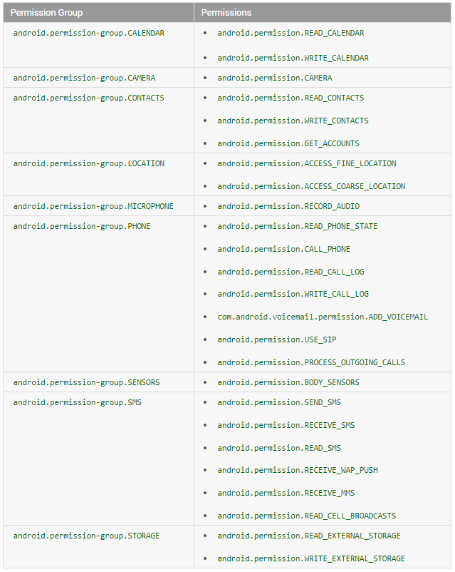

# Permission

权限是一种安全机制。Android权限主要用于限制应用程序内部某些具有限制性特性的功能使用以及应用程序之间的组件访问。
比如网络权限 <user-permission android:name="android.permission.INTERNET"/>当我们的程序需要访问网络的时候，必须添加这个权限，不添加则无法访问网络。

在Android6.0之前，我们只需要在AndroidManifest.xml文件中直接添加权限即可，但是在Android6.0之后，我们只在AndroidManifest.xml文件中配置是不够的，
还需要在Java代码中进行动态获取权限。当然这里不是所有的权限都需要动态获取，只需要获取危险权限就可以了。

** Note: 不是所有的权限都是需要动态申请的，只有重要的才需要动态申请**

