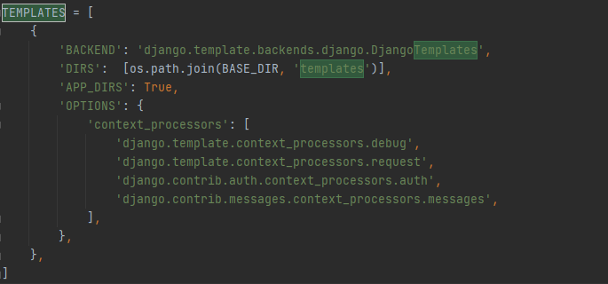
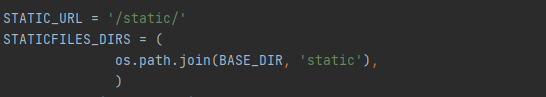
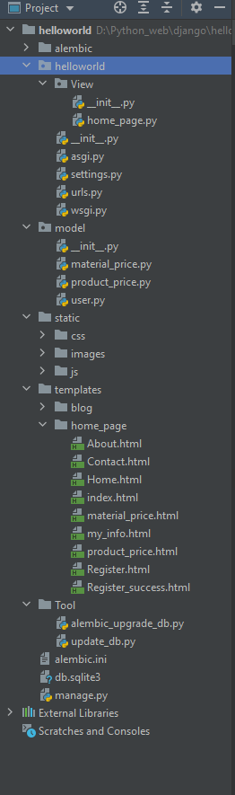

# Django Web Development

## Environment Setup

### Differenet Django need different Python version requirment
- Django 1.8  **Python 2.7, 3.2 , 3.3, 3.4, 3.5**
- Django 1.9  **Python 2.7, 3.4, 3.5**
- Django 1.11 **Python 2.7, 3.4, 3.5, 3.6**
- Django 2.0  **Python 3.5+**


### Setup Environment
- 安装pip
- Install Django **pip install django** 

## The first Django APP
- django-admin startproject HelloWorld
- Open settings.py, ALLOWED_HOSTS = ['*']
- python manage.py runserver 0.0.0.0:8000

## Django 工作原理


### Django 原理
浏览器输入的网页网址会到URL控制器，URL控制器解析网页网址，调用对应的view，view首先从Model获取对应的数据，将对应的数据传递给需要渲染的模板，
得到数据的模板会生成真正的html，并传递给浏览器。

## Django 配置面

Template:


Static Resource Location: (include css/js/images)


## 整体代码结构图


## Python url如何与view进行关联
```python
urlpatterns = [
    # Home Page URLS
    re_path(r'^$', home_page.index),
    re_path(r'^About', home_page.about),
    re_path(r'^Contact', home_page.contact),
    re_path(r'^Home', home_page.home),
    re_path(r'^login', home_page.login),
    re_path(r'^product_price', home_page.product_price),
    re_path(r'^material_price', home_page.material_price),
    re_path(r'^my_info', home_page.my_info),
    re_path(r'^register', home_page.register),
    re_path(r'^save_info', home_page.save_info),
]
```

## django view 如何往模板传递数据

view通过字典的方式将要传递的参数放到render的最后一个参数中。
```python
def save_info(request):
    context = {}
    username = request.session.get('username', 'anybody')
    user = User.byusername(username)
    if request.POST:
        update_name = request.POST['name']
        update_email = request.POST['email']
        update_password = request.POST['password']
        user.name = update_name
        user.pwd = update_password
        user.email_address = update_email
        db_session.commit()

        context['name'] = update_name
        context['password'] = update_password
        context['email_address'] = update_email
    return render(request, './home_page/my_info.html', context)
```
相应的，在对应的渲染模板中，需要使用参数的地方，使用'{{name}}'的方式进行包裹。
**Note: 如果传递的参数是不带空格的，则是不需要外面加引号的，否则需要引号**

## django如何记录当前的登录用户
当用户login的时候：
request.session['username'] = context['name']

当需要读取当前用户信息的时候：
username = request.session.get('username', 'anybody')

第一次运行可能会报错：
**python manage.py migrate**


## Some Tips
### Paint the Web
```python
from django.http import HttpResponse

return HttpResponse(message)
```

```python
from django.shortcuts import render_to_response

return render_to_response('search_form.html')
```

```python
from django.shortcuts import render

context          = {}
context['hello'] = 'Hello World!'
return render(request, 'hello.html', context)
```


### Form Handling

```html
    <form action="/search" method="get">
        <input type="text" name="search_context">
        <input type="submit" value="搜索">
    </form>    
```

```python

def search(request):  
    request.encoding='utf-8'
    print (request.GET)
    if "search_context" in request.GET:
        message = '你搜索的内容为: ' + request.GET["search_context"]
    else:
        message = '你提交了空表单'
    return HttpResponse(message)

```

```python
@csrf_exempt
def login_post(request):                                                                                             
    ctx = {}                                                                                                         
    if request.POST:                                                                                                 
        ctx['rlt'] = request.POST['login']                                                                           
                                                                                                                     
    return render(request, "index.html", ctx)                                                                        
```

### Django Admin
- Web site: 135.242.61.36:8000/admin/
- We need one super user:  **python manage.py createsuperuser**
- If we want to monitor the table , we need to add something:
  - In admin.py:
```Python
from blog.models import WebLogin                                                                                     
# Register your models here.                                                                                         
admin.site.register(WebLogin)  
```

### DB
- Create one DB Class, 
```python
class WebLogin(models.Model):                                                                                        
    name = models.CharField(max_length=20)                                                                           
    passwd = models.CharField(max_length=20)    
```

```python
def write_db(new_name, new_passwd):                                                                                  
    print("Enter Write DB, name is "+new_name+" passwd is "+ new_passwd )                                            
    login = WebLogin(name=new_name, passwd= new_passwd)                                                              
    login.save()     
```
```python
def read_all_db():                                                                                                   
    print("Enter read_all_db")                                                                                       
    response = ""                                                                                                    
    list = WebLogin.objects.all()                                                                                    
    for var in list:                                                                                                 
        response += var.name + " & Password is : " + var.passwd                                                      
    print (response)  
```

```python
def testdb(request):
    # 修改其中一个id=1的name字段，再save，相当于SQL中的UPDATE
    test1 = Test.objects.get(id=1)
    test1.name = 'Google'
    test1.save()
```

### Static File
In settings.py,
```Python
STATIC_URL = '/static/'
STATICFILES_DIRS = (                                                                                                 
    os.path.join(BASE_DIR, "static"),                                                                                
)
Check INSTALLED_APPS:
  django.contrib.staticfiles
```
In Root Directory, add one new directory **static**, put all cs/js in this directory.

HTML Part
```html
    load staticfiles                                                                                          
```

