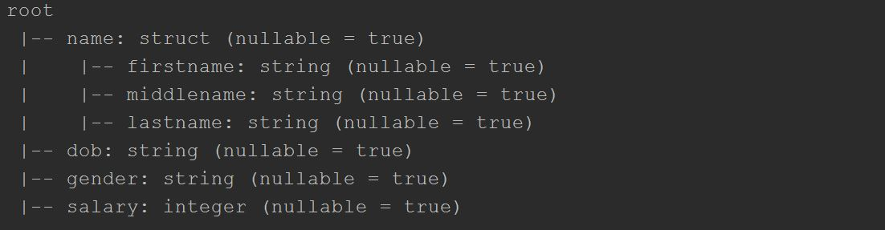

# rename nested column

We often need to rename one or multiple columns on Spark DataFrame, Especially when a column is nested it becomes complicated. 

## Step 0: create one dataset

```scala
val data = Seq(Row(Row("James ","","Smith"),"36636","M",3000),
  Row(Row("Michael ","Rose",""),"40288","M",4000),
  Row(Row("Robert ","","Williams"),"42114","M",4000),
  Row(Row("Maria ","Anne","Jones"),"39192","F",4000),
  Row(Row("Jen","Mary","Brown"),"","F",-1)
)

val schema = new StructType()
  .add("name",new StructType()
    .add("firstname",StringType)
    .add("middlename",StringType)
    .add("lastname",StringType))
  .add("dob",StringType)
  .add("gender",StringType)
  .add("salary",IntegerType)
  
  val df = spark.createDataFrame(spark.sparkContext.parallelize(data),schema)
df.printSchema()
```

