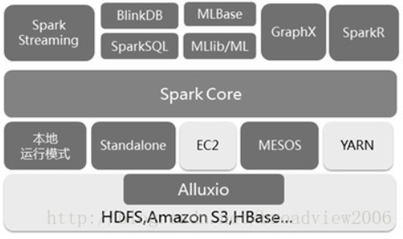
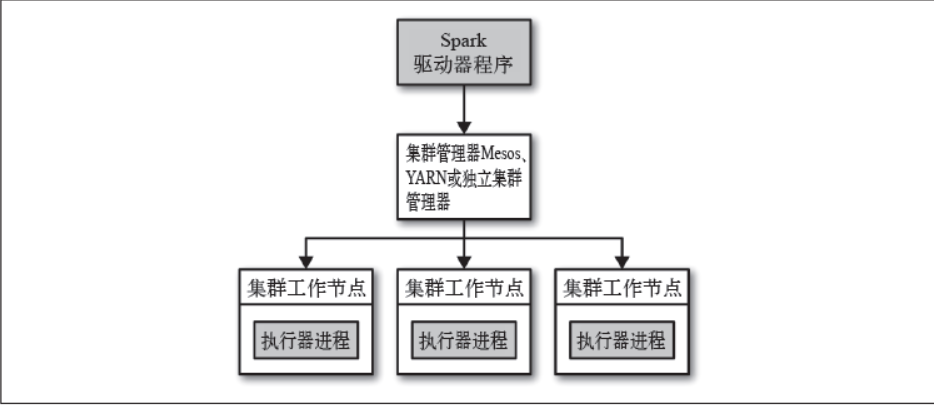

# Spark

Note that, before Spark 2.0, the main programming interface of Spark was the Resilient Distributed Dataset (RDD). 
After Spark 2.0, RDDs are replaced by Dataset, which is strongly-typed like an RDD, but with richer optimizations under the hood. 
The RDD interface is still supported, and you can get a more detailed reference at the RDD programming guide. 
However, we highly recommend you to switch to use Dataset, which has better performance than RDD. 
See the SQL programming guide to get more information about Dataset.

## Spark 的应用场景
　Spark 是一种与 Hadoop
相似的开源集群计算环境，是专为大规模数据处理而设计的快速通用的计算引擎，现已形成一个高速发展应用广泛的生态系统，主要应用场景如下：

　1. Spark是基于内存的迭代计算框架，适用于需要多次操作特定数据集的应用场合。需要反复操作的次数越多，所需读取的数据量越大，受益越大，数据量小但是计算密集度较大的场合，受益就相对较小;
　2. 由于RDD的特性，Spark不适用那种异步细粒度更新状态的应用，例如web服务的存储或者是增量的web爬虫和索引。就是对于那种增量修改的应用模型不适合：
　3. 数据量不是特别大，但是要求实时统计分析需求。

　满足以上条件的均可采用Spark技术进行处理，在实际应用中，目前大数据在互联网公司主要应用在广告、报表、推荐系统等业务上，在广告业务方面需要大数据做应用分析、效果分析、定向优化等，在推荐系统方面则需要大数据优化相关排名、个性化推荐以及热点点击分析等。

## HDFS
HDFS -- Hadoop Distributed File System.

## Spark 快于 Mapreduce的原因
- MapReduce通常需要将计算的中间结果写入磁盘，然后还要读取磁盘，从而导致了频繁的磁盘IO。
- Spark则不需要将计算的中间结果写入磁盘，这得益于Spark的RDD（弹性分布式数据集，很强大）和DAG（有向无环图），其中DAG记录了job的stage以及在job执行过程中父RDD和子RDD之间的依赖关系。中间结果能够以RDD的形式存放在内存中，且能够从DAG中恢复，大大减少了磁盘IO。

## Spark shuffle
Shuffle过程，也称Copy阶段。reduce task从各个map task上远程拷贝一片数据，并针对某一片数据，如果其大小超过一定的阀值，则写到磁盘上，否则直接放到内存中。
从以上分析，shuffle过程的基本要求：

　　1.完整地从map task端拉取数据到reduce task端

　　2.在拉取数据的过程中，尽可能地减少网络资源的消耗

　　3.尽可能地减少磁盘IO对task执行效率的影响

## Interactive Analysis with the Spark Shell

### Basic

Spark’s shell provides a simple way to learn the API, as well as a powerful tool to analyze data interactively. 
It is available in either Scala (which runs on the Java VM and is thus a good way to use existing Java libraries) or Python. 
Start it by running the following in the Spark directory:
```c
./bin/spark-shell
```

Spark’s primary abstraction is a distributed collection of items called a Dataset. Datasets can be created from Hadoop InputFormats (such as HDFS files) or by transforming other Datasets. Let’s make a new Dataset from the text of the README file in the Spark source directory:
```c
scala> val textFile = spark.read.textFile("README.md")
textFile: org.apache.spark.sql.Dataset[String] = [value: string]
```
You can get values from Dataset directly, by calling some actions, or transform the Dataset to get a new one. For more details, please read the API doc.
```c
scala> textFile.count() // Number of items in this Dataset
res0: Long = 126 // May be different from yours as README.md will change over time, similar to other outputs

scala> textFile.first() // First item in this Dataset
res1: String = # Apache Spark
```

** Filter 算子，首先获取一个集合，从集合中用Filter算子，filter部分单元，count是动作算子。**
```c
scala> val linesWithSpark = textFile.filter(line => line.contains("Spark"))
linesWithSpark: org.apache.spark.sql.Dataset[String] = [value: string]

scala> textFile.filter(line => line.contains("Spark")).count() // How many lines contain "Spark"?
res3: Long = 15
```

### 累加器
```c
scala> val accum = sc.longAccumulator("My Accumulator")
accum: org.apache.spark.util.LongAccumulator = LongAccumulator(id: 0, name: Some(My Accumulator), value: 0)

scala> sc.parallelize(Array(1, 2, 3, 4)).foreach(x => accum.add(x))
...
10/09/29 18:41:08 INFO SparkContext: Tasks finished in 0.317106 s

scala> accum.value
res2: Long = 10
```

Note: foreach 是无序的循环。
```c
scala> myarray.collect()
res0: Array[Int] = Array(1, 2, 3, 4)

scala>

scala> myarray.foreach(_ => print("hello"))
hellohellohellohello
scala> myarray.foreach(x => print(x))
1432
```
### 广播

用Broadcast广播的变量是只读变量，可以有效的保持数据的一致性。
Broadcast的Storage Level是MEMORY_AND_DISK方式，所以不会造成内存溢出。
Broadcast广播的变量只会在Executor中保存一份，同一个Executor中所有task共享该变量，可以有效的减少内存的开销。 
```
scala> val broadcastVar = sc.broadcast(Array(1, 2, 3))
broadcastVar: org.apache.spark.broadcast.Broadcast[Array[Int]] = Broadcast(0)

scala> broadcastVar.value
res0: Array[Int] = Array(1, 2, 3)

```
### flatMap

map和flatMap的区别：

map：对集合中每个元素进行操作。 
flatMap：对集合中每个元素进行操作然后再扁平化。 

```c
val arr=sc.parallelize(Array(("A",1),("B",2),("C",3)))
arr.flatmap(x=>(x._1+x._2)).foreach(println)
```
OUTPUT:
```c
A
1
B
2
C
3
```

```c
val arr=sc.parallelize(Array(("A",1),("B",2),("C",3)))
arr.map(x=>(x._1+x._2)).foreach(println)
```
OUTPUT:
```c
A1
B2
C3
```

### reduce
reduce(binary_function)
reduce将RDD中元素前两个传给输入函数，产生一个新的return值，新产生的return值与RDD中下一个元素（第三个元素）组成两个元素，再被传给输入函数，直到最后只有一个值为止。
```c
  val listRdd = spark.sparkContext.parallelize(List(1,2,3,4,5,3,2))
  println("output sum using binary : "+listRdd.reduce(_ min _))
  println("output min using binary : "+listRdd.reduce(_ max _))
  println("output max using binary : "+listRdd.reduce(_ + _))
```

```c
  val listRdd = spark.sparkContext.parallelize(List(1,2,3,4,5,3,2))
  println("output min : "+listRdd.reduce( (a,b) => a min b))
  println("output max : "+listRdd.reduce( (a,b) => a max b))
  println("output sum : "+listRdd.reduce( (a,b) => a + b))
```
```c
val c = sc.parallelize(1 to 10)
c.reduce((x, y) => x + y)//结果55
```

### reduceByKey
reduceByKey就是对元素为KV对的RDD中Key相同的元素的Value进行binary_function的reduce操作，因此，Key相同的多个元素的值被reduce为一个值，然后与原RDD中的Key组成一个新的KV对。
```c
val a = sc.parallelize(List((1,2),(1,3),(3,4),(3,6)))
a.reduceByKey((x,y) => x + y).collect
```

### parallelize
```c
     data = [1, 2, 3, 4, 5]  
    distData = sc.parallelize(data)  
```

### 流处理
SparkStreaming是流式处理框架，是Spark API的扩展，支持可扩展、高吞吐量、容错的实时数据流处理，实时数据的来源可以是：Kafka, Flume, Twitter, ZeroMQ或者TCP sockets，
并且可以使用高级功能的复杂算子来处理流数据。例如：map,reduce,join,window 。最终，处理后的数据可以存放在文件系统，数据库等，方便实时展现。

```
// 在本地启动名为SimpleDemo的SparkStreaming应用
// 该应用拥有两个线程，其批处理时间间隔为1s
// 创建SparkConf
val conf = new SparkConf().setMaster("local[2]").setAppName("SimpleDemo")
// 从SparkConf创建StreamingContext并指定1秒钟的批处理大小
val ssc = new StreamingContext(conf, Seconds(1))
// 创建ReceiverInputDStream，该InputDStream的Receiver监听本地机器的7777端口
val lines = ssc.socketTextStream("localhost", 7777) // 类型是ReceiverInputDStream
// 从DStream中筛选出包含字符串"error"的行，构造出了
// lines -> errorLines -> .print()这样一个DStreamGraph
val errorLines = lines.filter(_.contains("error"))
// 打印出含有"error"的行
errorLines.print()

// 启动流计算环境StreamingContext并等待它"完成"
ssc.start()
// 等待作业完成
ssc.awaitTermination()

```

#### Spark与kafka的关系。
在生产者一端，我们将数据按照每天的拉取时间存入了Kafka当中，而在消费者一端，我们利用了spark streaming从kafka中不断拉取数据进行词频统计。
```
object DirectKafkaWordCount {
  def main(args: Array[String]): Unit = {
    if (args.length < 3) {
      System.err.println(s"""
        |Usage: DirectKafkaWordCount <brokers> <groupId> <topics>
        |  <brokers> is a list of one or more Kafka brokers
        |  <groupId> is a consumer group name to consume from topics
        |  <topics> is a list of one or more kafka topics to consume from
        |
        """.stripMargin)
      System.exit(1)
    }

    StreamingExamples.setStreamingLogLevels()

    val Array(brokers, groupId, topics) = args

    // Create context with 2 second batch interval
    val sparkConf = new SparkConf().setAppName("DirectKafkaWordCount")
    val ssc = new StreamingContext(sparkConf, Seconds(2))

    // Create direct kafka stream with brokers and topics
    val topicsSet = topics.split(",").toSet
    val kafkaParams = Map[String, Object](
      ConsumerConfig.BOOTSTRAP_SERVERS_CONFIG -> brokers,
      ConsumerConfig.GROUP_ID_CONFIG -> groupId,
      ConsumerConfig.KEY_DESERIALIZER_CLASS_CONFIG -> classOf[StringDeserializer],
      ConsumerConfig.VALUE_DESERIALIZER_CLASS_CONFIG -> classOf[StringDeserializer])
    val messages = KafkaUtils.createDirectStream[String, String](
      ssc,
      LocationStrategies.PreferConsistent,
      ConsumerStrategies.Subscribe[String, String](topicsSet, kafkaParams))

    // Get the lines, split them into words, count the words and print
    val lines = messages.map(_.value)
    val words = lines.flatMap(_.split(" "))
    val wordCounts = words.map(x => (x, 1L)).reduceByKey(_ + _)
    wordCounts.print()

    // Start the computation
    ssc.start()
    ssc.awaitTermination()
  }
}
```

#### Spark socket stream
```
object NetworkWordCount {
  def main(args: Array[String]): Unit = {
    if (args.length < 2) {
      System.err.println("Usage: NetworkWordCount <hostname> <port>")
      System.exit(1)
    }

    StreamingExamples.setStreamingLogLevels()

    // Create the context with a 1 second batch size
    val sparkConf = new SparkConf().setAppName("NetworkWordCount")
    val ssc = new StreamingContext(sparkConf, Seconds(1))

    // Create a socket stream on target ip:port and count the
    // words in input stream of \n delimited text (eg. generated by 'nc')
    // Note that no duplication in storage level only for running locally.
    // Replication necessary in distributed scenario for fault tolerance.
    val lines = ssc.socketTextStream(args(0), args(1).toInt, StorageLevel.MEMORY_AND_DISK_SER)
    val words = lines.flatMap(_.split(" "))
    val wordCounts = words.map(x => (x, 1)).reduceByKey(_ + _)
    wordCounts.print()
    ssc.start()
    ssc.awaitTermination()
  }
}
```


### Spark 生态


从生态图上，Spark系统构成有几个主要因素：

1. Spark 设计的基于不同场景的库，包括流，数据库，ML，图像，
2. Spark 自带的Spark Core
3. 大数据的资源调度器，资源调度器，可以使用Spark自带的Standalone，也可以使用三方的Hadoop YARN，Apache Mesos
4. 文件系统，Spark没有自己的分布式文件系统，需要三方的分布式文件系统，HDFS, S3
 
### Spark 架构


### Spark 集群管理器
一、独立集群管理器

Spark独立集群管理器提供的在集群上运行应用的简单方法。要使用集群启动脚本，按照以下步骤执行即可：
1、将编译好的Spark发送到集群的其他节点相同的目录下，例如: /home/opt/spark
2、设置集群的主节点和其他机器的SSH免密码登录
3、编辑主节点的conf/slaves文件，添加上所有的工作节点的主机名
4、在主节点上运行sbin/start-all.sh启动集群，可以在http://masternode:8080上看到集群管理界面
5、要停止集群，在主节点上运行 sbin/stop-all.sh
二、Hadoop Yarn

YARN是Hadoop2.0中引入的集群管理器，可以让多中数据处理框架运行在一个共享的资源池上，而且和Hadoop的分布式存储系统（HDFS）安装在同一个物理节点上。所以让Spark运行在配置了YARN的集群上是一个非常好的选择，这样当Spark程序运行在存储节点上的时候可以快速的访问HDFS中的数据。
在Spark中使用YARN的步骤：

1.找到你的Hadoop的配置目录，然后把它设置问环境变量HADOOP_CONF_DIR。
export HADOOP_CONF_DIR="..."
然后采用如下方式提交作业
spark-submit --master yarn yourapp

2、配置资源用量
(1) --executor-memory 设置每个执行器的内存用量
(2)--executor-cores 设置每个执行器进程从YARN中占用的核心数目
(3)--num-wxecutors Spark应用会使用固定数量的执行器节点，默认为2
三、Apache Mesos

Mesos是一个通用的集群管理器，既可以运行分析性负载又可以运行长期运行的服务。
在Mesos上使用Spark，可以采用以下方式：
spark-submit --master mesos://masternode:5050 yourapp

1、Mesos的调度模式
Mesos的调度模式分为两种：粗粒度模式和细粒度模式
粗粒度模式：只Spark会提前为每个执行器分配固定数量的CPU，而且在任务结束前不会释放这些资源。
可以通过设置spark.mesos.coarse为true，开启粗粒度调度模式
细粒度模式(默认)：执行器进程占用的CPU核心数会在执行任务的过程中动态变化。

2、配置资源用量
(1) --executor-memory 设置每个执行器的资源
(2) --total-executor-cores 设置应用占用的核心数

### Spark 持久化
[持久化](https://zhuanlan.zhihu.com/p/61555283)
