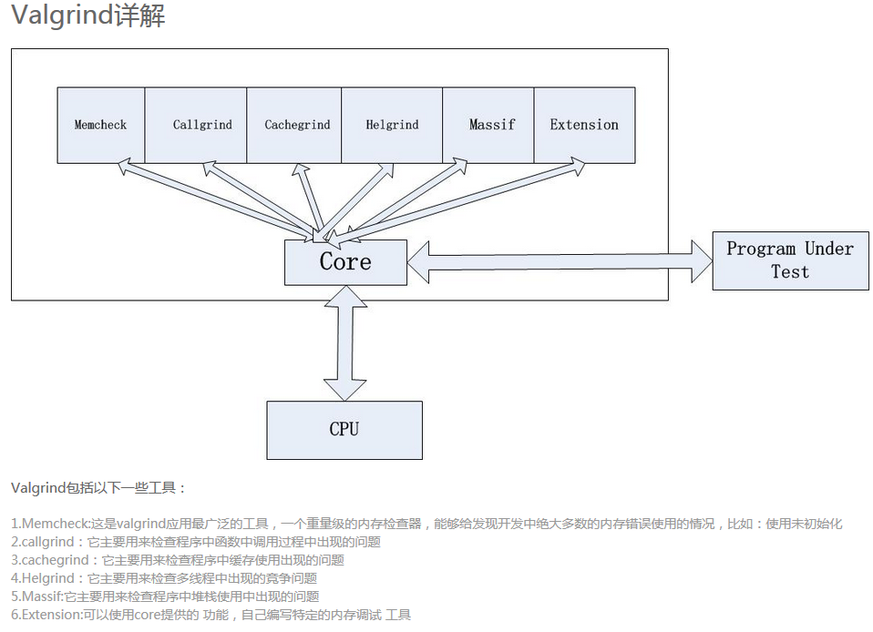

# Valgrind

Valgrind /ˈvælɡrɪnd/ is a programming tool for memory debugging, memory leak detection, and profiling.
Valgrind was originally designed to be a free memory debugging tool for Linux on x86, but has since evolved to become a generic framework for creating dynamic analysis tools such as checkers and profilers. 

Valgrind is one tool set.  including memcheck, callgrind, cachegrind, helgrind, massif, Extension.



## Example

```c
#include <stdlib.h>
int* func(void)
{
   int* x = malloc(10 * sizeof(int));
   x[10] = 0;
}                  
 int main(void)
{
   int* x=NULL;
   x=func();
   //free(x);
   x=NULL;
   return 0;
 }

```
```c
gcc test.c -g -o test
```

```c
[johnsonz@sfu03 memcheck]$ valgrind --tool=memcheck --leak-check=full ./test
==20251== Memcheck, a memory error detector
==20251== Copyright (C) 2002-2012, and GNU GPL'd, by Julian Seward et al.
==20251== Using Valgrind-3.8.1 and LibVEX; rerun with -h for copyright info
==20251== Command: ./test
==20251== 
==20251== Invalid write of size 4
==20251==    at 0x80483DF: func (test.c:5)
==20251==    by 0x80483FC: main (test.c:10)
==20251==  Address 0x402a050 is 0 bytes after a block of size 40 alloc'd
==20251==    at 0x40072B2: malloc (vg_replace_malloc.c:270)
==20251==    by 0x80483D5: func (test.c:4)
==20251==    by 0x80483FC: main (test.c:10)
==20251== 
==20251== 
==20251== HEAP SUMMARY:
==20251==     in use at exit: 40 bytes in 1 blocks
==20251==   total heap usage: 1 allocs, 0 frees, 40 bytes allocated
==20251== 
==20251== 40 bytes in 1 blocks are definitely lost in loss record 1 of 1
==20251==    at 0x40072B2: malloc (vg_replace_malloc.c:270)
==20251==    by 0x80483D5: func (test.c:4)
==20251==    by 0x80483FC: main (test.c:10)
==20251== 
==20251== LEAK SUMMARY:
==20251==    definitely lost: 40 bytes in 1 blocks
==20251==    indirectly lost: 0 bytes in 0 blocks
==20251==      possibly lost: 0 bytes in 0 blocks
==20251==    still reachable: 0 bytes in 0 blocks
==20251==         suppressed: 0 bytes in 0 blocks
==20251== 
==20251== For counts of detected and suppressed errors, rerun with: -v
==20251== ERROR SUMMARY: 2 errors from 2 contexts (suppressed: 12 from 8)

```
**Invalid write of size 4：表示数组越界写了4字节；**
**40 bytes in 1 blocks：表示因程序退出而发生内存泄露40字节；**

## Valgrind 中memcheck 
- 使用未初始化的内存 (Use of uninitialised memory)
- 使用已经释放了的内存 (Reading/writing memory after it has been free'd)
- 使用超过malloc分配的内存空间(Reading/writing off the end of malloc'd blocks)
- 对堆栈的非法访问 (Reading/writing inappropriate areas on the stack)
- 申请的空间是否有释放 (Memory leaks – where pointers to malloc'd blocks are lost forever)
- malloc/free/new/delete申请和释放内存的匹配(Mismatched use of malloc/new/new [] vs free/delete/delete [])
- src和dst的重叠(Overlapping src and dst pointers in memcpy() and related functions)
- 重复free