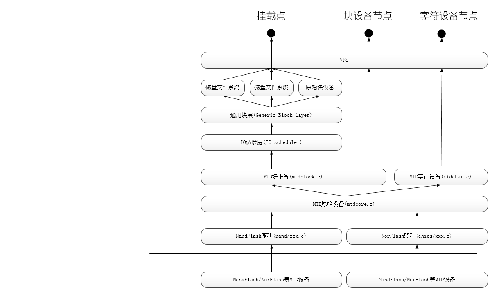

# MTD Layer

MTD: Memory technology device. It aims to manage FLASH HW Device in Linux system.

MTD 作为设备的管理层，向上层提供统一的接口。不同的FLASH 芯片可以基于当前MTD框架与自己的FLASH芯片驱动整合。
MTD代码存储于/driver/mtd. NAND Flash 不同NAND FLASH的驱动位于/driver/mtd/nand, Nor Flash 的驱动位于/driver/mtd/chips

## MTD Init

Mtd 在初始化时，会将同一类型的flash划分成一个mtd device。这个device的大小等于所以芯片容量的总和。
这个过程完成后，就会从内核启动参数或者默认的分区表中获得分区信息。最后，将每个分区作为，一个mtd device添加到mtd_tables中。

通过**cat /proc/mtd**可以获取到mtd_tables的信息。

```c
[root@AONT: /]# cat /proc/mtd 
dev:    size   erasesize  name
mtd0: xxxxxxxx xxxxxxxx "boot"
mtd1: xxxxxxxx xxxxxxxx "test1"
mtd2: xxxxxxxx xxxxxxxx "test1"
mtd3: xxxxxxxx xxxxxxxx "test1"
mtd4: xxxxxxxx xxxxxxxx "test1"
mtd5: xxxxxxxx xxxxxxxx "test1"
mtd6: xxxxxxxx xxxxxxxx "test1"
mtd7: xxxxxxxx xxxxxxxx "test1"
mtd8: xxxxxxxx xxxxxxxx "test1"
mtd9: xxxxxxxx xxxxxxxx "test1"
mtd10: xxxxxxxx xxxxxxxx "test1"
mtd11: xxxxxxxx xxxxxxxx "test1"
mtd12: xxxxxxxx xxxxxxxx "test1"
mtd13: xxxxxxxx xxxxxxxx "test1"
mtd14: xxxxxxxx xxxxxxxx "test1"
mtd15: xxxxxxxx xxxxxxxx "test1"

```

## MTD Code Frame
