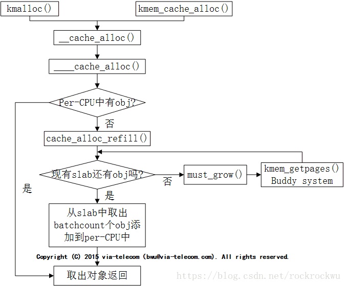

# slab mechanism in Linux System

Now slab is one common concept for system memory management. There are main three allocators: slob, slab, slub.

## Defination & Difference

**The SLOB (Simple list of blocks) allocator is one of three available memory allocators in the Linux kernel. (The other two are SLAB and SLUB.) 
The SLOB allocator is designed to require little memory for the implementation and housekeeping, for use in small systems such as embedded systems. 
Unfortunately, a major limitation of the SLOB allocator is that it suffers greatly from internal fragmentation. **

**Slab allocation is a memory management mechanism intended for the efficient memory allocation of objects. Compared to earlier mechanisms, 
it reduces fragmentation caused by allocations and deallocations. The technique is used to retain allocated memory that contains a data object of 
a certain type for reuse upon subsequent allocations of objects of the same type. It is analogous to an object pool, but only applies to memory, not other resources. **

**SLUB ("the unqueued slab allocator") is a memory management mechanism intended for the efficient memory allocation of kernel objects which displays 
the desirable property of eliminating fragmentation caused by allocations and deallocations. 
The technique is used to retain allocated memory that contains a data object of a certain type for reuse upon subsequent allocations of objects of the same type.
 It is used in Linux and became the default allocator since 2.6.23.**
 
## Code Flow for slab

