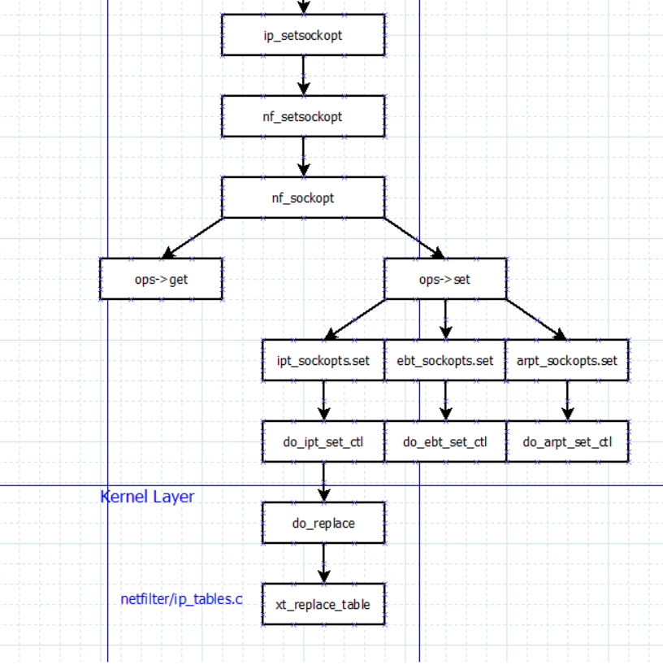

# iptables

```c
iptables -n -v -L -t filter
iptables -nL --line-number
iptables -D INPUT 1
iptables -t filter -I INPUT -s 135.242.61.59  -j TEST
iptables -I TEST -s 135.242.61.59 -j DROP
```
udp spt:bootps dpt:bootpc--> Lay 4: udp  source port: DHCP Server port,67 , destination port 68

## iptables Rule
### Target
- return: 从子chain RETURN后，从jump的下一句规则继续。
- LOG: 记录Log
- DROP: 直接丢弃
- REJECT: 丢弃但是回复对方

### port
- bootps: dhcp server 67
- bootpc: dhcp client 68
- http: 80
- ftp: 21
- ssh: 22
- telnet: 23
- domain: 53
- https: 443
- webcache: 8080
- netbios-ns:
- netbios-dgm:
- netbios-ssn


## iptables setting flow


