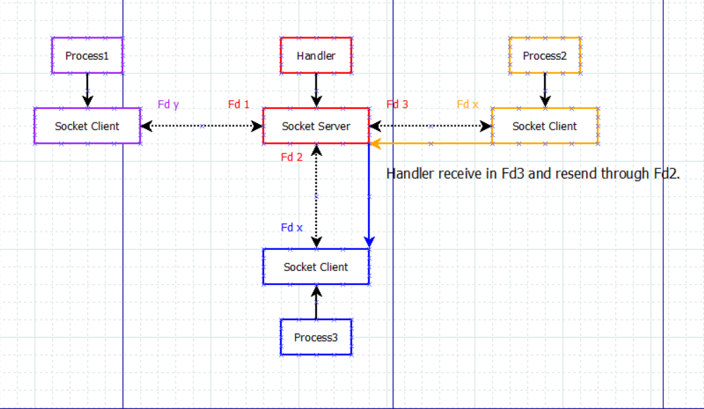

# Message handler

Linux提供了几种进程间通信的方式，包括管道，信号量，消息队列，共享内存以及socket等等。
当需要通信的进程只有两个，进行互相之间的通信，以上所有方法都能很好的完成任务。

考虑到以下情况，如果系统中进程比较多，并且相互之间需要进行通信的话，按照上面的通信方式，
每个进程需要消耗很多的精力去处理跟各个进程之间的通信问题。

基于这种情况，我们可以通过一个进程来专门实现消息的转发。具体的思路如下：
转发进程作为socket的server端进行监听，任何想进行通信的进程在启动指出都要通过socket clinet
去跟server通信，server端会记录下server端的socket fd，与此同时，client端也记录client的socket。
进程A如果想发送消息给进程B，直接通过之前的socket fd发送给转发进程，并加一个结构体说明这个包
目的地是谁。转发进程通过监听socket，读取并解析，并通过fd(与对应进程的socket fd)进行发送。

