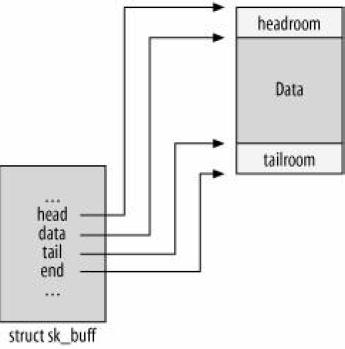
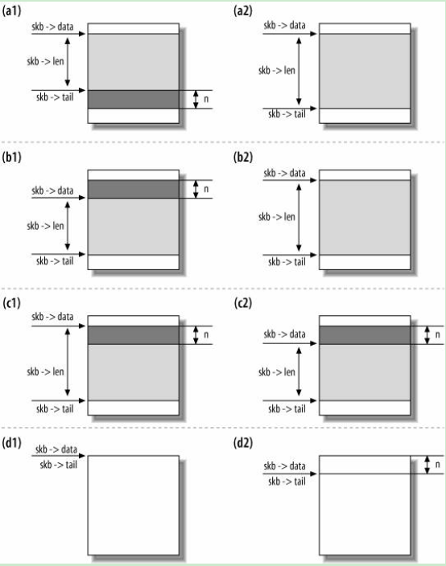

# Structure

主要是对Linux网络协议栈中的主要结构体做一个说明。

## sk_buff
**This structure comes from Linux 2.6 Version**

```c
struct sk_buff {
    /* These two members must be first. */
    struct sk_buff      *next;   //sk_buff 是由双向链表来管理的。
    struct sk_buff      *prev;

    ktime_t         tstamp;		// 记录一个skb packet的收包时间。

    struct sock     *sk;		// This is one variable which is related with socket, if the packet 
								// is send by local or received by local process, then we need this.
								// If we only to forward the packet, the pointer is NULL.
    struct net_device   *dev;	//If the packet is received, it means which device the packet is received from,
								// If the packet will be sent, it means which device the packet is sent through.

    /*
     * This is the control buffer. It is free to use for every
     * layer. Please put your private variables there. If you
     * want to keep them across layers you have to do a skb_clone()
     * first. This is owned by whoever has the skb queued ATM.
     */
    char            cb[48] __aligned(8);

    unsigned long       _skb_refdst;
#ifdef CONFIG_XFRM
    struct  sec_path    *sp;
#endif
    unsigned int        len,   // len 指的是当前协议包的数据长度，处在网络层，即IP报文的长度，处在TCP层，即TCP报文的长度。
                data_len;		// 只有分片报文才有效。
    __u16           mac_len,	// size of MAC Header.
                hdr_len;
    union {
        __wsum      csum;		// checksum
        struct {
            __u16   csum_start;
            __u16   csum_offset;
        };
    };
    __u32           priority;	//Qos related
    kmemcheck_bitfield_begin(flags1);
    __u8            local_df:1,
                cloned:1,		//This skb buffer is cloned from another skb.
                ip_summed:2,
                nohdr:1,
                nfctinfo:3;		//netfilter conntract related.
    __u8            pkt_type:3,	//Initialzed by eth_type_trans
                fclone:2,
                ipvs_property:1,
                peeked:1,
                nf_trace:1;
    kmemcheck_bitfield_end(flags1);
    __be16          protocol;

    void            (*destructor)(struct sk_buff *skb);	//It's one callback function. It ususlly is initialized by socket.
														//When skb is freed, it may be triggered to handle memory.
#if defined(CONFIG_NF_CONNTRACK) || defined(CONFIG_NF_CONNTRACK_MODULE)
    struct nf_conntrack *nfct;		//related with netfilter conntrack
    struct sk_buff      *nfct_reasm;//related with netfilter conntrack
#endif
#ifdef CONFIG_BRIDGE_NETFILTER
    struct nf_bridge_info   *nf_bridge;	// Netfilter related
#endif

    int         skb_iif;
#ifdef CONFIG_NET_SCHED
    __u16           tc_index;   /* traffic control index */	// Traffic control related
#ifdef CONFIG_NET_CLS_ACT
    __u16           tc_verd;    /* traffic control verdict */
#endif
#endif

    __u32           rxhash;

    kmemcheck_bitfield_begin(flags2);
    __u16           queue_mapping:16;
#ifdef CONFIG_IPV6_NDISC_NODETYPE
    __u8            ndisc_nodetype:2,
                deliver_no_wcard:1;
#else
    __u8            deliver_no_wcard:1;
#endif
    kmemcheck_bitfield_end(flags2);

    /* 0/14 bit hole */

#ifdef CONFIG_NET_DMA
    dma_cookie_t        dma_cookie;
#endif
#ifdef CONFIG_NETWORK_SECMARK
    __u32           secmark;
#endif
    union {
        __u32       mark;
        __u32       dropcount;
    };

    __u16           vlan_tci;

    sk_buff_data_t      transport_header;
    sk_buff_data_t      network_header;
    sk_buff_data_t      mac_header;
    /* These elements must be at the end, see alloc_skb() for details.  */
    sk_buff_data_t      tail;
    sk_buff_data_t      end;
    unsigned char       *head,
                *data;
    unsigned int        truesize;
    atomic_t        users;
};


```

### head/end/data/tail


skb->data, 是指当前有效数据的头
skb->tail，是指当前有效数据的尾

### skb_put/skb_push/skb_pull/skb_reserve
```c
static inline unsigned char *skb_put(struct sk_buff *skb, unsigned int len)
{
    unsigned char *tmp = skb->tail;
    SKB_LINEAR_ASSERT(skb);
    skb->tail += len;
    skb->len  += len;
    if (unlikely(skb->tail>skb->end))
        skb_over_panic(skb, len, current_text_addr());
    return tmp;
}
```

```c
static inline unsigned char *skb_push(struct sk_buff *skb, unsigned int len)
{
    skb->data -= len;
    skb->len  += len;
    if (unlikely(skb->data<skb->head))
        skb_under_panic(skb, len, current_text_addr());
    return skb->data;
}
```

```c
static inline unsigned char *skb_pull(struct sk_buff *skb, unsigned int len)
{
    return unlikely(len > skb->len) ? NULL : __skb_pull(skb, len);
}
static inline unsigned char *__skb_pull(struct sk_buff *skb, unsigned int len)
{
    skb->len -= len;
    BUG_ON(skb->len < skb->data_len);
    return skb->data += len;
}
```



### alloc_skb
** skb_share_info is for IP Fragment **
```c
static inline struct sk_buff *alloc_skb(unsigned int size,
                    gfp_t priority)
{   
    return __alloc_skb(size, priority, 0);
}     

struct sk_buff *__alloc_skb(unsigned int size, gfp_t gfp_mask,
                int fclone)
{                          
    struct sk_buff *skb;
    u8 *data;

    /* Get the HEAD */
    if (fclone)
        skb = kmem_cache_alloc(skbuff_fclone_cache,
                       gfp_mask & ~__GFP_DMA);
    else
        skb = kmem_cache_alloc(skbuff_head_cache,
                       gfp_mask & ~__GFP_DMA);

    if (!skb)
        goto out;
     
    /* Get the DATA. Size must match skb_add_mtu(). */
    size = SKB_DATA_ALIGN(size);
    data = kmalloc(size + sizeof(struct skb_shared_info), gfp_mask);
    if (!data)
        goto nodata;    

    memset(skb, 0, offsetof(struct sk_buff, truesize));
    skb->truesize = size + sizeof(struct sk_buff);
    atomic_set(&skb->users, 1);
    skb->head = data;
    skb->data = data;
    skb->tail = data;
    skb->end  = data + size;
}
```

### skb_clone/pskb_copy/skb_copy

**skb_clone only copy sk_buff structure , do not copy the data buffer part.**
```c

struct sk_buff *skb_clone(struct sk_buff *skb, gfp_t gfp_mask)
{
    struct sk_buff *n;

    n = skb + 1;
    if (skb->fclone == SKB_FCLONE_ORIG &&
        n->fclone == SKB_FCLONE_UNAVAILABLE) {
        atomic_t *fclone_ref = (atomic_t *) (n + 1);
        n->fclone = SKB_FCLONE_CLONE;
        atomic_inc(fclone_ref);
    } else {
        n = kmem_cache_alloc(skbuff_head_cache, gfp_mask);
        if (!n)
            return NULL;
        n->fclone = SKB_FCLONE_UNAVAILABLE;
    }

#define C(x) n->x = skb->x

    n->next = n->prev = NULL;
    n->sk = NULL;
    C(tstamp);
    C(dev);
    C(h);
    C(nh);
    C(mac);
    C(dst);
    dst_clone(skb->dst);
    C(sp);
    skb->cloned = 1;

    return n;
}

```

```c
struct sk_buff *pskb_copy(struct sk_buff *skb, gfp_t gfp_mask)
{
    /*
     *  Allocate the copy buffer
     */
    struct sk_buff *n = alloc_skb(skb->end - skb->head, gfp_mask);
    
    if (!n)
        goto out;
    
    /* Set the data pointer */ 
    skb_reserve(n, skb->data - skb->head);
    /* Set the tail pointer and length */
    skb_put(n, skb_headlen(skb));
    /* Copy the bytes */
    memcpy(n->data, skb->data, n->len);
    n->csum      = skb->csum;
    n->ip_summed = skb->ip_summed;

    n->data_len  = skb->data_len;
    n->len       = skb->len;
    
    if (skb_shinfo(skb)->nr_frags) {
        int i;

        for (i = 0; i < skb_shinfo(skb)->nr_frags; i++) {
            skb_shinfo(n)->frags[i] = skb_shinfo(skb)->frags[i];
            get_page(skb_shinfo(n)->frags[i].page);
        }
        skb_shinfo(n)->nr_frags = i;
    }
    
    if (skb_shinfo(skb)->frag_list) {
        skb_shinfo(n)->frag_list = skb_shinfo(skb)->frag_list;
        skb_clone_fraglist(n);
    }
    
    copy_skb_header(n, skb);
out:
    return n;
}
```

```c
struct sk_buff *skb_copy(const struct sk_buff *skb, gfp_t gfp_mask)
{
    int headerlen = skb->data - skb->head;
    /*
     *  Allocate the copy buffer
     */
    struct sk_buff *n = alloc_skb(skb->end - skb->head + skb->data_len,
                      gfp_mask);
    if (!n)
        return NULL;

    /* Set the data pointer */
    skb_reserve(n, headerlen);
    /* Set the tail pointer and length */
    skb_put(n, skb->len);
    n->csum      = skb->csum;
    n->ip_summed = skb->ip_summed;

    if (skb_copy_bits(skb, -headerlen, n->head, headerlen + skb->len))
        BUG();

    copy_skb_header(n, skb);
    return n;
}
```

## net_device

```c

struct net_device
{

    /*
     * This is the first field of the "visible" part of this structure
     * (i.e. as seen by users in the "Space.c" file).  It is the name
     * the interface.
     */
    char            name[IFNAMSIZ];
    /* device name hash chain */
    struct hlist_node   name_hlist;

    /*
     *  I/O specific fields
     *  FIXME: Merge these and struct ifmap into one
     */
    unsigned long       mem_end;    /* shared mem end   */
    unsigned long       mem_start;  /* shared mem start */
    unsigned long       base_addr;  /* device I/O address   */
    unsigned int        irq;        /* device IRQ number    */

    /*
     *  Some hardware also needs these fields, but they are not
     *  part of the usual set specified in Space.c.
     */

    unsigned char       if_port;    /* Selectable AUI, TP,..*/
    unsigned char       dma;        /* DMA channel      */

    unsigned long       state;

    struct net_device   *next;

    /* The device initialization function. Called only once. */
    int         (*init)(struct net_device *dev);

    /* ------- Fields preinitialized in Space.c finish here ------- */

    /* Net device features */
    unsigned long       features;
#define NETIF_F_SG      1   /* Scatter/gather IO. */
#define NETIF_F_IP_CSUM     2   /* Can checksum only TCP/UDP over IPv4. */
#define NETIF_F_NO_CSUM     4   /* Does not require checksum. F.e. loopack. */
#define NETIF_F_HW_CSUM     8   /* Can checksum all the packets. */
#define NETIF_F_HIGHDMA     32  /* Can DMA to high memory. */
#define NETIF_F_FRAGLIST    64  /* Scatter/gather IO. */
#define NETIF_F_HW_VLAN_TX  128 /* Transmit VLAN hw acceleration */
#define NETIF_F_HW_VLAN_RX  256 /* Receive VLAN hw acceleration */
#define NETIF_F_HW_VLAN_FILTER  512 /* Receive filtering on VLAN */
#define NETIF_F_VLAN_CHALLENGED 1024    /* Device cannot handle VLAN packets */
#define NETIF_F_TSO     2048    /* Can offload TCP/IP segmentation */
#define NETIF_F_LLTX        4096    /* LockLess TX */

    struct net_device   *next_sched;

    /* Interface index. Unique device identifier    */
    int         ifindex;		// ifindex , a unique ID, assigned to each device when it is registered with a call to dev_new_index
    int         iflink;			// Mainly used for tunnel


    struct net_device_stats* (*get_stats)(struct net_device *dev);
    struct iw_statistics*   (*get_wireless_stats)(struct net_device *dev);

    /* List of functions to handle Wireless Extensions (instead of ioctl).
     * See <net/iw_handler.h> for details. Jean II */
    const struct iw_handler_def *   wireless_handlers;
    /* Instance data managed by the core of Wireless Extensions. */
    struct iw_public_data * wireless_data;

    struct ethtool_ops *ethtool_ops;

    /*
     * This marks the end of the "visible" part of the structure. All
     * fields hereafter are internal to the system, and may change at
     * will (read: may be cleaned up at will).
     */


    unsigned short      flags;  /* interface flags (a la BSD)   */
    unsigned short      gflags;
        unsigned short          priv_flags; /* Like 'flags' but invisible to userspace. */
    unsigned short      padded; /* How much padding added by alloc_netdev() */

    unsigned        mtu;    /* interface MTU value      */
    unsigned short      type;   /* interface hardware type  */
    unsigned short      hard_header_len;    /* hardware hdr length  */

    struct net_device   *master; /* Pointer to master device of a group,
                      * which this device is member of.
                      */
    /* Interface address info. */
    unsigned char       perm_addr[MAX_ADDR_LEN]; /* permanent hw address */
    unsigned char       addr_len;   /* hardware address length  */
    unsigned short          dev_id;     /* for shared network cards */

    struct dev_mc_list  *mc_list;   /* Multicast mac addresses  */
    int         mc_count;   /* Number of installed mcasts   */
    int         promiscuity;
    int         allmulti;


    /* Protocol specific pointers */

    void            *atalk_ptr; /* AppleTalk link   */
    void            *ip_ptr;    /* IPv4 specific data   */
    void                    *dn_ptr;        /* DECnet specific data */
    void                    *ip6_ptr;       /* IPv6 specific data */
    void            *ec_ptr;    /* Econet specific data */
    void            *ax25_ptr;  /* AX.25 specific data */

/*
 * Cache line mostly used on receive path (including eth_type_trans())
 */
    struct list_head    poll_list ____cacheline_aligned_in_smp;
                    /* Link to poll list    */

    int         (*poll) (struct net_device *dev, int *quota);
    int         quota;
    int         weight;
    unsigned long       last_rx;    /* Time of last Rx  */
    /* Interface address info used in eth_type_trans() */
    unsigned char       dev_addr[MAX_ADDR_LEN]; /* hw address, (before bcast 
                            because most packets are unicast) */

    unsigned char       broadcast[MAX_ADDR_LEN];    /* hw bcast add */

/*
 * Cache line mostly used on queue transmit path (qdisc)
 */
    /* device queue lock */
    spinlock_t      queue_lock ____cacheline_aligned_in_smp;
    struct Qdisc        *qdisc;
    struct Qdisc        *qdisc_sleeping;
    struct list_head    qdisc_list;
    unsigned long       tx_queue_len;   /* Max frames per queue allowed */
    /* ingress path synchronizer */
    spinlock_t      ingress_lock;
    struct Qdisc        *qdisc_ingress;

/*
 * One part is mostly used on xmit path (device)
 */
    /* hard_start_xmit synchronizer */
    spinlock_t      xmit_lock ____cacheline_aligned_in_smp;
    /* cpu id of processor entered to hard_start_xmit or -1,
       if nobody entered there.
     */
    int         xmit_lock_owner;
    void            *priv;  /* pointer to private data  */
    int         (*hard_start_xmit) (struct sk_buff *skb,
                            struct net_device *dev);
    /* These may be needed for future network-power-down code. */
    unsigned long       trans_start;    /* Time (in jiffies) of last Tx */

    int         watchdog_timeo; /* used by dev_watchdog() */
    struct timer_list   watchdog_timer;

/*
 * refcnt is a very hot point, so align it on SMP
 */
    /* Number of references to this device */
    atomic_t        refcnt ____cacheline_aligned_in_smp;  // reference for this device

    /* delayed register/unregister */
    struct list_head    todo_list;
    /* device index hash chain */
    struct hlist_node   index_hlist;

    /* register/unregister state machine */
    enum { NETREG_UNINITIALIZED=0,
           NETREG_REGISTERING,  /* called register_netdevice */
           NETREG_REGISTERED,   /* completed register todo */
           NETREG_UNREGISTERING,    /* called unregister_netdevice */
           NETREG_UNREGISTERED, /* completed unregister todo */
           NETREG_RELEASED,     /* called free_netdev */
    } reg_state;

    /* Called after device is detached from network. */
    void            (*uninit)(struct net_device *dev);
    /* Called after last user reference disappears. */
    void            (*destructor)(struct net_device *dev);
    /* Pointers to interface service routines.  */
    int         (*open)(struct net_device *dev);
    int         (*stop)(struct net_device *dev);
#define HAVE_NETDEV_POLL
    int         (*hard_header) (struct sk_buff *skb,
                        struct net_device *dev,
                        unsigned short type,
                        void *daddr,
                        void *saddr,
                        unsigned len);
    int         (*rebuild_header)(struct sk_buff *skb);
#define HAVE_MULTICAST           
    void            (*set_multicast_list)(struct net_device *dev);
#define HAVE_SET_MAC_ADDR        
    int         (*set_mac_address)(struct net_device *dev,
                           void *addr);
#define HAVE_PRIVATE_IOCTL
    int         (*do_ioctl)(struct net_device *dev,
                        struct ifreq *ifr, int cmd);
#define HAVE_SET_CONFIG
    int         (*set_config)(struct net_device *dev,
                          struct ifmap *map);
#define HAVE_HEADER_CACHE
    int         (*hard_header_cache)(struct neighbour *neigh,
                             struct hh_cache *hh);
    void            (*header_cache_update)(struct hh_cache *hh,
                               struct net_device *dev,
                               unsigned char *  haddr);
#define HAVE_CHANGE_MTU
    int         (*change_mtu)(struct net_device *dev, int new_mtu);

#define HAVE_TX_TIMEOUT
    void            (*tx_timeout) (struct net_device *dev);

    void            (*vlan_rx_register)(struct net_device *dev,
                            struct vlan_group *grp);
    void            (*vlan_rx_add_vid)(struct net_device *dev,
                           unsigned short vid);
    void            (*vlan_rx_kill_vid)(struct net_device *dev,
                            unsigned short vid);

    int         (*hard_header_parse)(struct sk_buff *skb,
                             unsigned char *haddr);
    int         (*neigh_setup)(struct net_device *dev, struct neigh_parms *);
#ifdef CONFIG_NETPOLL
    struct netpoll_info *npinfo;
#endif
#ifdef CONFIG_NET_POLL_CONTROLLER
    void                    (*poll_controller)(struct net_device *dev);
#endif

    /* bridge stuff */
    struct net_bridge_port  *br_port;

#ifdef CONFIG_NET_DIVERT
    /* this will get initialized at each interface type init routine */
    struct divert_blk   *divert;
#endif /* CONFIG_NET_DIVERT */

    /* class/net/name entry */
    struct class_device class_dev;
};
```

### ifindex
```c
int register_netdevice(struct net_device *dev)
{
    dev->ifindex = dev_new_index();
}

static int dev_new_index(void)
{
    static int ifindex;
    for (;;) {
        if (++ifindex <= 0)
            ifindex = 1;
        if (!__dev_get_by_index(ifindex))
            return ifindex;
    }
}

```

### refcnt
**refcnt 的意思是device的引用次数，一个关键点是在unregister device的时候，必须ref清0 才可以**

#### dev_get_by_name 与  __dev_get_by_name
```c
struct net_device *dev_get_by_name(const char *name)
{
    struct net_device *dev;
    
    read_lock(&dev_base_lock);
    dev = __dev_get_by_name(name);
    if (dev)
        dev_hold(dev);
    read_unlock(&dev_base_lock);
    return dev;
}

#define dev_hold(dev) atomic_inc(&(dev)->refcnt)


struct net_device *__dev_get_by_name(const char *name)
{
    struct hlist_node *p;

    hlist_for_each(p, dev_name_hash(name)) {
        struct net_device *dev
            = hlist_entry(p, struct net_device, name_hlist);
        if (!strncmp(dev->name, name, IFNAMSIZ))
            return dev;
    }
    return NULL;
}
```

#### dev_get_by_index 与 __dev_get_by_index

```c
struct net_device *dev_get_by_index(int ifindex)
{
    struct net_device *dev;

    read_lock(&dev_base_lock);
    dev = __dev_get_by_index(ifindex);
    if (dev)
        dev_hold(dev);
    read_unlock(&dev_base_lock);
    return dev;
}

struct net_device *__dev_get_by_index(int ifindex)
{
    struct hlist_node *p;

    hlist_for_each(p, dev_index_hash(ifindex)) {
        struct net_device *dev
            = hlist_entry(p, struct net_device, index_hlist);
        if (dev->ifindex == ifindex)
            return dev;
    }
    return NULL;
}
```